# NBA 선수 은퇴나이 예측해보기

### 데이터 준비

1. kaggle
   1. 2020년까지 NBA Players 정보
   2. 2010-2020년까지 NBA 선수들 부상 정보
2. 위키백과
   1. 크롤링으로 2010-2020년까지 은퇴 선수 목록

### 위키백과 NBA 선수 은퇴 정보 크롤링

#### 필요한 패키지 불러오기

```python
from urllib.request import urlopen
from bs4 import BeautifulSoup
from urllib.request import urlopen
from urllib.error   import HTTPError
from urllib.error   import URLError
import pandas as pd
```

#### 셀리엄 불러오기

```python
from selenium import webdriver
import time
path = './driver/chromedriver.exe'
driver = webdriver.Chrome(path)
```

#### 크롤링 함수 만들기

```python
def craw():
    time_list = ['2010-11','2011-12','2012-13','2013-14','2014-15','2015-16','2016-17','2017-18','2018-19','2019-20','2020-21']
    day_list = ['2010','2011','2012','2013','2014','2015','2016','2017','2018','2019','2020']
    name_list = []
    age_list = []
    year_list = []
    cnt = 0
    for day in time_list:
        driver.get('https://en.wikipedia.org/wiki/List_of_'+str(day)+'_NBA_season_transactions')
        page = driver.find_elements_by_css_selector('.wikitable')
        page = page[0]
        for i in page.find_elements_by_tag_name('tbody'):
            k = i.find_elements_by_tag_name('tr')
            for idx,j in enumerate(k):
                if idx == 0:
                    continue
                else:
                    td_list = j.find_elements_by_tag_name('td')
                    if len(td_list) == 6: 
                        name_list.append(j.find_elements_by_tag_name('td')[1].text)
                        age_list.append(j.find_elements_by_tag_name('td')[3].text)
                        year_list.append(day_list[cnt])
                    elif len(td_list) == 5:
                        name_list.append(j.find_elements_by_tag_name('td')[0].text)
                        age_list.append(j.find_elements_by_tag_name('td')[2].text)
                        year_list.append(day_list[cnt])
            cnt +=1
            print(cnt)
    return name_list, age_list, year_list
```

1. 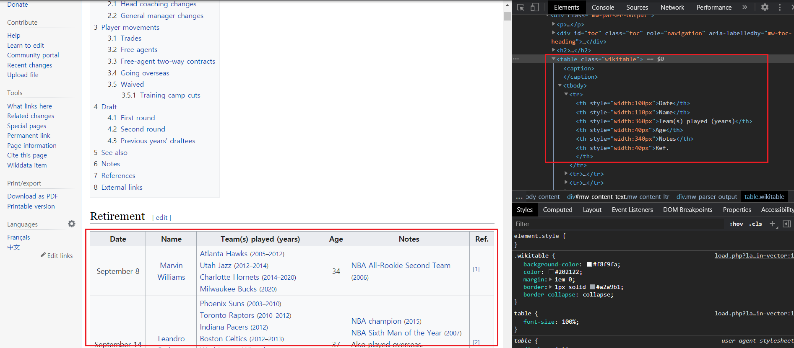

   - 가져와야 할 데이터가 wikitable class로 되어있고 그 안에 tbody와 td, tr로 이루어져 있었다.
   - 그거에 맞게 크롤링 구조를 구성하였다.

#### 크롤링하기

```python
name_list, age_list, year_list = craw()
```

#### df로 만들기

```python
nba_df = pd.DataFrame({
    'name' : name_list,
    'age' : age_list,
    'season' : year_list
})
```

#### csv로 저장

```python
nba_df.to_csv('./data/nba_df.csv',mode='w',index=False)
```

### 분석해보기

#### 필요한 패키지 import

```python
import pandas as pd
import numpy as np
import matplotlib as mpl
import matplotlib.pyplot as plt
import matplotlib.pylab as plt
import datetime 
%matplotlib inline
import matplotlib
matplotlib.rcParams['axes.unicode_minus'] = False

import matplotlib.pyplot as plt
%matplotlib inline

import platform
import seaborn as sns

import warnings
warnings.filterwarnings('ignore')

from matplotlib import font_manager, rc
from matplotlib import style

if platform.system() == 'Darwin':
    rc('font', family='AppleGothic')
elif platform.system() == 'Windows':
    path = "c:/Windows/Fonts/malgun.ttf"
    font_name = font_manager.FontProperties(fname=path).get_name()
    rc('font', family=font_name)
else:
    print('Unknown system... sorry~~~~') 
```

#### 파일 불러오기

```python
nba_retire = pd.read_csv('nba_df.csv')
nba_all = pd.read_csv('all_seasons.csv')
nba_injury = pd.read_csv('injuries_2010-2020.csv')
```

#### 정보 확인 함수

```python
def info(df):
    display(df.describe())
    display(df.info())
    display(df.isna().sum())
```

- 비어있는 값이 있는지 어떤 행의 값이 어떤 type인지 확인해본다.

#### EDA

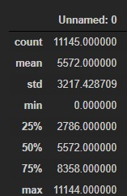

```python
nba_all.drop('Unnamed: 0',axis=1,inplace=True)
```

- 필요없는 행이 있어서 제거

```python
nba_injury_sum = nba_injury.groupby('Relinquished', as_index=False).agg({'Notes':'count'}).sort_values('Notes',ascending=False).reset_index(drop=True)
```

- 선수들의 부상 횟수를 묶어서 저장한다.

```python
nba_player = nba_all.groupby('player_name',as_index=False).agg({'season':'count'}).sort_values('season',ascending=False).reset_index(drop=True)
```

- 선수들의 선수생활 기간을 저장한다.

```python
nba_1020_injury = pd.merge(nba_player,nba_injury_sum,left_on='player_name',right_on='Relinquished')

nba_1020_injury.drop('Relinquished',axis=1,inplace=True)
```

- 부상횟수와 선수생활 파일을 합친다.

```python
nba_retire_merge = pd.merge(nba_1020_injury, nba_retire,left_on='player_name',right_on='name')

nba_retire_merge.drop('name',axis=1,inplace=True)

nba_retire_merge.columns=['name','year','count','retire_age','retire_season']
```

- 위에서 만든 파일과 은퇴 파일을 합친다.

```python
nba_retire_merge.head()
```

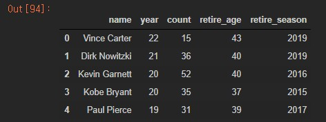

- 최종적으로 만들어진 파일은 다음과 같다.

```python
nba_retire_merge.describe()
```

- 요약해보았다.

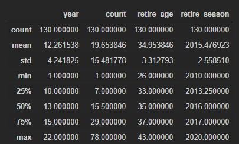

#### 상관관계 구해보기

```python
def corr(data,text):
    corr = data.corr(method='pearson')
    display(corr)
    style.use('ggplot')
    plt.title(text)
    sns.heatmap(data = corr, annot=True, fmt = '.2f', linewidths=.5, cmap='Blues')
```

```python
corr(nba_retire_merge,'상관관계')
```

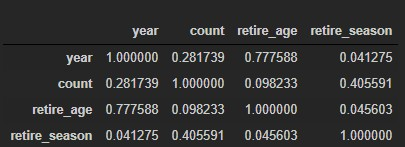

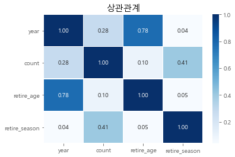

- 생각처럼 부상횟수가 은퇴에 큰 영향을 미친다고 보기 어려웠다. 오히려 year(리그에서 생활한 기간)이 은퇴나이와 연관이 더 높았다. 

#### 부상 횟수 상위 10명 알아보기

```python
nba_retire_merge.sort_values('count',ascending=False).head(10).reset_index(drop=True)
```

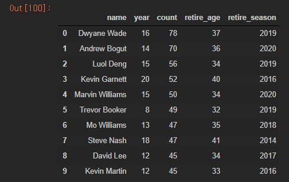

- 드웨인 웨이드는 아직 은퇴하기 아쉬울 정도로 일찍 은퇴한 감이 있었다. 많은 부상에도 불구하고 평균보다 더  많이 뛰었다. 1위와 2위는 챔피언을 경험한 선수들이다. 많은 경기를 뛴 만큼 데미지가 많았을 텐데 현대 의학의 발전덕분일까?

### 부상 정보 다시 크롤링해서 가져오기

- 2010~2020년 사이에 은퇴한 선수들의 데뷔초부터 부상정보를 가져오기 위해 다시 크롤링 하였다.
  - 기준은 빈스카터의 데뷔 연도 1998년도를 기준으로 가져왔다.

#### 필요한 패키지 import

```python
from urllib.request import urlopen
from bs4 import BeautifulSoup
from urllib.request import urlopen
from urllib.error   import HTTPError
from urllib.error   import URLError

import pandas as pd

from selenium import webdriver
import time
path = '../driver/chromedriver.exe'
driver = webdriver.Chrome(path)
```

#### 크롤링 함수 만들기

```python
def craw(start,end):
    page_list = [ i for i in range(start,end,25)]
    Date = []
    Team = []
    Acquired = []
    Relinquished = []
    Notes = []
    for page in page_list:
        driver.get('http://www.prosportstransactions.com/basketball/Search/SearchResults.php?Player=&Team=&BeginDate=1998-01-01&EndDate=2020-12-31&ILChkBx=yes&Submit=Search&start='+str(page))
        page = driver.find_elements_by_css_selector('.datatable')
        if len(page) != 0:
            for i in page[0].find_elements_by_tag_name('tbody'):
                k = i.find_elements_by_tag_name('tr')
                for data in k:
                    ll = data.find_elements_by_tag_name('td')
                    Date.append(ll[0].text)
                    Team.append(ll[1].text)
                    Acquired.append(ll[2].text)
                    Relinquished.append(ll[3].text)
                    Notes.append(ll[4].text)
    return   Date,Team, Acquired,Relinquished, Notes
```

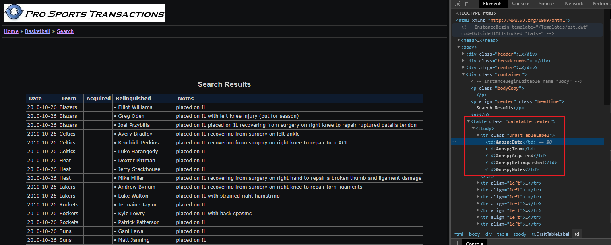

- 테이블이 datatable class로 되어있어서 이걸로 tbody와 tr, td로 찾아서 저장하였다.

#### 함수 실행하기

```python
Date,Team, Acquired,Relinquished, Notes = craw(0,5001)
Date1,Team1, Acquired1,Relinquished1, Notes1 = craw(5001,10001)
Date2,Team2, Acquired2,Relinquished2, Notes2 = craw(10001,15001)
Date3,Team3, Acquired3,Relinquished3, Notes3 = craw(15000,20001)
Date4,Team4, Acquired4,Relinquished4, Notes4 = craw(20001,25001)
Date5,Team5, Acquired5,Relinquished5, Notes5 = craw(25001,28526)
```

- 25개씩  이루어져있어 start, end로 url을 맞춰주었다. 28525를 해버리니 중간에 렉이 걸려서 따로 따로 실행하였다.

#### df로 만들기

```python
df1 = pd.DataFrame({
    'Date':Date,
    'Team' : Team,
    'Acquired' : Acquired,
    'Relinquished' : Relinquished,
    'Notes' : Notes    
                   })
```

- 이런 식으로 5개의 df를 만들었다.

```python
df1.to_csv('df1.csv',mode='w',index=False)
```

- 혹시 몰라서 csv로 우선 저장하였다.

#### 중복 컬럼 제거하기

```python
nba_injury_1998 = pd.concat([df1,df2,df3,df4,df5,df6])
drop_index = list(nba_injury_1998[nba_injury_1998['Date']==' Date'].index)
nba_injury_1998 = nba_injury_1998.drop(drop_index).reset_index(drop=True)
none_Relinquished = list(nba_injury_1998[nba_injury_1998['Relinquished'] ==''].index)
nba_injury_1998 = nba_injury_1998.drop(none_Relinquished).reset_index(drop=True)
nba_injury_1998 = nba_injury_1998.drop(['Acquired'],axis=1)  
nba_injury_1998.to_csv('nba_injury_1998.csv',mode='w',index=False)
```

- 데이터들을 행으로 합치고 중간에 컬럼이 계속 중복으로 들어가서 그것의 인덱스를 찾아서 제거해준다.
- 또한 Relinquished가 비어있는 행을 지우고 Acquired 열도 지운다.

#### 정리

```python
for i in range(nba_injury_1998.shape[0]):
    if nba_injury_1998.loc[i,'Relinquished'] != '':
        nba_injury_1998.loc[i,'Relinquished'] = nba_injury_1998.loc[i,'Relinquished'].split('•')[1].strip()
        nba_injury_1998.loc[i,'Date'] = nba_injury_1998.loc[i,'Date'].strip()
        nba_injury_1998.loc[i,'Team'] = nba_injury_1998.loc[i,'Team'].strip()
        nba_injury_1998.loc[i,'Notes'] = nba_injury_1998.loc[i,'Notes'].strip()
    if nba_injury_1998.loc[i,'Relinquished'] =='':
        nba_injury_1998.loc[i,'Relinquished'] = nba_injury_1998.loc[i,'Relinquished']
        nba_injury_1998.loc[i,'Date'] = nba_injury_1998.loc[i,'Date'].strip()
        nba_injury_1998.loc[i,'Team'] = nba_injury_1998.loc[i,'Team'].strip()
        nba_injury_1998.loc[i,'Notes'] = nba_injury_1998.loc[i,'Notes'].strip()
```

- `• Elliot Williams` 데이터 앞에 기호와 띄어쓰기가 있어서 정리해주었다. 다른 행도 띄어쓰기를 정리하였다.

```python
for i in range(nba_injury_1998.shape[0]):
    data = nba_injury_1998.loc[i,'Notes'].split('with')
    print(data)
    if data[0] in  ['placed on IL ','placed on IR ']:
        nba_injury_1998.loc[i,'Notes2'] = data[1].strip()
    else:
        nba_injury_1998.loc[i,'Notes2'] = nba_injury_1998.loc[i,'Notes']
```

- 부상 앞에 placed on IR with 혹은 placed on IL with 가 있어서 뒤에것만 저장하였다.

### EDA2

```python
name_list = nba_retire.groupby(['name']).count().sort_values('age',ascending=False)
name_list = list(name_list[name_list['age'] == 2].index)
name_lis

>
['Keyon Dooling',
 'Rasheed Wallace',
 'Elton Brand',
 'Nazr Mohammed',
 'Brandon Roy',
 'Nick Collison',
 'Boštjan Nachbar']
```

- 다음의 선수들이 2개씩 있어서 이른 시즌에 있는 것들을 지우기로 하였다.

```python
index_list = []
while len(name_list) > 0:
    cnt = len(name_list)
    for idx, value in nba_retire.iterrows():
        if value[0] in name_list:
            index_list.append(idx)
            name_list.remove(value[0]) 
nba_retire = nba_retire.drop(index_list).reset_index(drop=True)
```

- 정상적으로 지워졌다.

```python
nba_player = nba_all.groupby('player_name',as_index=False).agg({'season':'count'}).sort_values('season',ascending=False).reset_index(drop=True)
```

#### 이름 바꿔주기

```python
nba_01 = pd.merge(nba_retire, nba_player, left_on='name', right_on='player_name',how='left').sort_values('season_y').reset_index(drop=True)
nba_01 = nba_01.drop(['season_x','player_name'],axis=1).rename({'season_y':'season'},axis=1)
name_list = ['Rasho Nesterovic','Zydrunas Ilgauskas','Peja Stojakovic','T.J. Ford','Eduardo Najera','Vladimir Stepania','Darko Milicic',
             'Hedo Turkoglu','Kosta Perovic','Raul Lopez','Andres Nocioni','Primoz Brezec','Bostjan Nachbar','Jiri Welsch',
            'PJ Hairston','Manu Ginobili','Mike Dunleavy','Mirza Teletovic','Gerald Henderson','Jose Calderon','Kevin Seraphin']
cnt = 0
for i in range(155,176):
    nba_01.loc[i,'name'] = name_list[cnt]
    cnt += 1
```

- 은퇴 정보와 player정보를 합쳐서 어떤 선수의 정보가 합쳐지지 않았는지 확인하고 nba_all 원래 파일에 이름을 대조하여 리스트를 만들었다.
  - 그 다음 해당 리스트의 있는 정보들을 바꾸어주었다.

```python
nba_02 = pd.merge(nba_01, nba_player, left_on='name', right_on='player_name').drop(['season_x','player_name'],axis=1).rename({'season_y':'season'},axis=1)
```

- 이름을 바꿔준 파일을 다시 merge하였다.

```python
nba_injury_sum = nba_injury.groupby('name', as_index=False).agg({'Notes':'count'}).sort_values('Notes',ascending=False).reset_index(drop=True)
```

- 부상 횟수를 합쳤을 때 이름에 전처리 해야할 것들이 많았다.

#### injury에 있는 이름 바꿔주기

```python
import re
re.split('[/)]',nba_injury_sum.loc[0,'name'])
```

- 이러한 식으로 바꿔주려고 한다.

#### 이름 바꿔주기 적용

```python
import re
for i in range(nba_injury_sum.shape[0]):
    for namedata in re.split('[/()]',nba_injury_sum.loc[i,'name']):
        if namedata.strip() in list(nba_02['name']):
            print(namedata.strip())
            nba_injury_sum.loc[i,'name'] = namedata.strip()
```

- 다음과 같이 특수 부호 있는 부분을 나누고 다시 for를 돌려 나눠진 이름중에 nba_02['name']에 있으면 그 이름을 행의 값으로 저장하였다.

```
		   name	Notes
0	Tony Parker	50
```

- 토니 파거나 여타 다른 것들은 적용이 되었다.

```
								 name	      Notes
17	Nene / Nene Hilario / Maybyner Hilario	        29
28	James Michael McAdoo / James McAdoo (Michael)	26
```

- 그러니 이렇게 적용 안 된 부분이 있어서 다시 확인하려고 한다.

- 그냥 이대로 진행해도 될 것 같아서 그대로 진행하기로 하였다.

#### NaN값 제거

```python
nba_injury_merge = pd.merge(nba_02,nba_injury_sum,on='name',how='left').sort_values('Notes',ascending=False).reset_index(drop=True)
nba_injury_merge.dropna(inplace=True)
nba_injury_merge.sort_values('season',ascending=False).reset_index(drop=True)
```

### 다시 상관관계

```python
corr(nba_injury_merge,'상관관계')
```

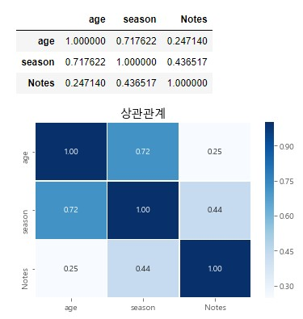

- 전보다 0.14가 올랐다. 데이터 수를 더 찾은게 도움이 된 듯하다. 그러나 아직도 높은 수치는 아니다.

#### 부상 횟수 상위 10명 상관관계

```python
top_10 = nba_injury_merge.sort_values('Notes',ascending=False).head(10).reset_index(drop=True)
corr(top_10,'상관관계')
```

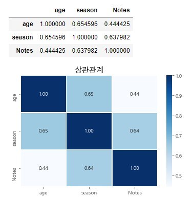

- 상관관계가 많이 높아졌다. 상위로 뽑아서 그런지 어느정도 영향을 주나보다.

#### 부상 횟수 상위 15명 상관관계

```python
top_15 = nba_injury_merge.sort_values('Notes',ascending=False).head(15).reset_index(drop=True)
corr(top_15,'상관관계')
```

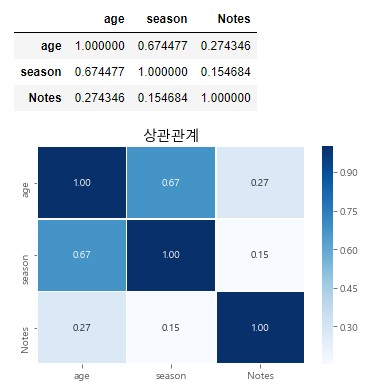

- 상위 15명부터 확 떨어진다. 

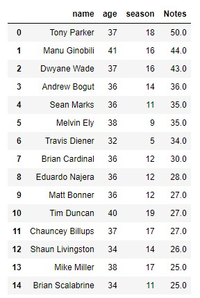

- 아마 5,6위 때문에 상위 10명은 높게 나온것 같다. 
- 그럼 이제 예측을 연구해보자.

### 의사결정나무 예측

#### 필요한 패키지 import

```python
from sklearn.datasets import load_iris
from sklearn.tree     import DecisionTreeClassifier
from sklearn.model_selection import train_test_split, KFold, cross_val_score, cross_validate,  GridSearchCV
from sklearn.metrics import accuracy_score
from sklearn.preprocessing import StandardScaler

import sklearn
print(sklearn.__version__)
```

#### 데이터 준비

```python
nba_label = nba_injury_merge['age']
nba_data = nba_injury_merge.loc[:,['season','Notes']]

X_train, X_test, y_train, y_test =train_test_split(nba_data, nba_label, test_size = 0.2,  random_state=5)
```

- label은 은퇴나이고 data는 뛴 연도와 부상 횟수이다.
- 테스트와 트레인 데이터를 나눈다.

#### 예측해보기

```python
nba_dtc = DecisionTreeClassifier(random_state=5)
nba_dtc.fit(X_train, y_train)

nba_dtc_entropy = DecisionTreeClassifier(random_state=5, criterion='entropy')
nba_dtc_entropy.fit(X_train, y_train)

predition_gini = nba_dtc.predict(X_test)

predition_entropy = nba_dtc_entropy.predict(X_test)

print('예측 정확도 : %.2f' % accuracy_score(y_test, predition_gini))
print('예측 정확도 : %.2f' % accuracy_score(y_test, predition_entropy))

>
예측 정확도 : 0.26
예측 정확도 : 0.23
```

- gini와 entropy로 나누어서 예측해 보았다, 두 가지 모두 정확도가 굉장히 낮았다.

```python
nba_gini_pred = pd.DataFrame({
    '원래나이' : y_test,
    '예측나이': predition_gini
})
nba_gini_pred
```

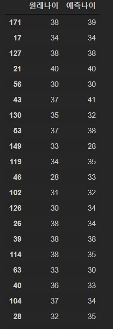

- 거의 맞는게 없다.

### Kfold 추가해서 하기

```python
kfold = KFold(n_splits=5)
cv_accuracy = []
print('nba_data', nba_data.shape[0])

nba_label_arr = np.array(nba_label.tolist())
display(nba_label_arr)
nba_data_arr = np.array([[nba_data.get_value(i,'season'),nba_data.get_value(i,'Notes')] for i in nba_data.index])
display(nba_data_arr)

>
array([37, 41, 37, 36, 36, 38, 32, 36, 36, 37, 36, 40, 34, 38, 34, 34, 34,
       34, 38, 35, 38, 40, 34, 34, 34, 35, 38, 36, 32, 40, 30, 37, 35, 39,
       34, 33, 37, 34, 29, 38, 36, 35, 40, 37, 34, 33, 28, 38, 36, 34, 35,
       33, 34, 37, 33, 37, 30, 35, 36, 36, 33, 30, 41, 33, 29, 31, 35, 33,
       37, 35, 37, 29, 37, 31, 35, 33, 39, 37, 39, 37, 30, 37, 36, 36, 38,
       34, 31, 43, 37, 37, 32, 32, 36, 28, 30, 40, 33, 40, 37, 37, 34, 36,
       31, 34, 37, 37, 32, 31, 26, 31, 37, 37, 35, 35, 38, 35, 37, 31, 42,
       34, 32, 36, 29, 38, 35, 38, 30, 38, 31, 34, 35, 28, 36, 35, 36, 40,
       34, 34, 31, 31, 33, 32, 35, 39, 28, 37, 37, 41, 32, 33, 35, 35, 31,
       35, 28, 37, 27, 31, 32, 33, 34, 31, 31, 26, 30, 36, 35, 38, 33, 28,
       39, 38, 33])
array([[18., 50.],
       [16., 44.],
       [16., 43.],
       [14., 36.],
       [11., 35.],
       [ 9., 35.],
       [ 5., 34.],
       [12., 30.],
       [12., 28.]
```

- Kfold로 나누어서 더 세밀한 예측을 해보기로 하였다.
- 우선 array로 데이터를 바꾸었다.

#### 교차검증 정확도 확인하기

```python
n_iter = 0
for train_idx, test_idx in kfold.split(nba_data):
    X_train, X_test = nba_data_arr[train_idx],nba_data_arr[test_idx]
    y_train, y_test = nba_label_arr[train_idx], nba_label_arr[test_idx]

    # 학습을 진행하겠다면?
    nba_dtc.fit(X_train, y_train)
    # 예측
    fold_pred = nba_dtc.predict(X_test)
    
    # 정확도 측정
    n_iter += 1
    accuracy = np.round(accuracy_score(y_test, fold_pred),4)
    print('\n{}교차검증 정확도 :  {}, 학습 데이터 크기 : {}, 검증 데이터 크기 : {}'.format(n_iter, accuracy,X_train.shape[0], X_test.shape[0]))
    cv_accuracy.append(accuracy)
print('\n\n')
print('\n 평균 검증 정확도 : ', np.mean(cv_accuracy))   

>
1교차검증 정확도 :  0.1143, 학습 데이터 크기 : 138, 검증 데이터 크기 : 35

2교차검증 정확도 :  0.2571, 학습 데이터 크기 : 138, 검증 데이터 크기 : 35

3교차검증 정확도 :  0.1714, 학습 데이터 크기 : 138, 검증 데이터 크기 : 35

4교차검증 정확도 :  0.0882, 학습 데이터 크기 : 139, 검증 데이터 크기 : 34

5교차검증 정확도 :  0.0882, 학습 데이터 크기 : 139, 검증 데이터 크기 : 34

 평균 검증 정확도 :  0.14384000000000002
```

- 형편없는 정확도다.

### cross_validate로 해보기

> Kfold처럼 검증 가능

```python
scoring = cross_val_score(nba_dtc,nba_data_arr,nba_label_arr,scoring='accuracy',cv=3 )
print('교차 검증별 정확도 :',scoring)
print('평균 검증 정확도 :',np.mean(scoring))
>
교차 검증별 정확도 : [0.22413793 0.24137931 0.12280702]
평균 검증 정확도 : 0.19610808630772336
```

- 어째 정확도가 마음에 들지 않는다.

```python
scoring2 = cross_validate(nba_dtc,nba_data_arr,nba_label_arr,scoring='accuracy',cv=10)
print('교차 검증 정보 :',scoring2)
print('교차 검증별 정확도 :',scoring2['test_score'])
print('교차 검증 시간 :',scoring2['fit_time'])
print('평균 검증 정확도 :',np.mean(scoring2['test_score']))

>
교차 검증 정보 : {'fit_time': array([0.00099874, 0.00099587, 0.        , 0.00199699, 0.00199533,
       0.0009973 , 0.0010004 , 0.00199723, 0.        , 0.00099063]), 'score_time': array([0.0009973 , 0.        , 0.00099754, 0.        , 0.        ,
       0.        , 0.        , 0.        , 0.0010047 , 0.        ]), 'test_score': array([0.22222222, 0.38888889, 0.33333333, 0.17647059, 0.23529412,
       0.11764706, 0.05882353, 0.05882353, 0.29411765, 0.11764706])}
교차 검증별 정확도 : [0.22222222 0.38888889 0.33333333 0.17647059 0.23529412 0.11764706
 0.05882353 0.05882353 0.29411765 0.11764706]
교차 검증 시간 : [0.00099874 0.00099587 0.         0.00199699 0.00199533 0.0009973
 0.0010004  0.00199723 0.         0.00099063]
평균 검증 정확도 : 0.20032679738562092
```

- 교차 검증의 정보들을 확인하고 정확도도 확인해보았다.

###  GridSearchCV로 해보기

```python
gscv_tree = DecisionTreeClassifier(random_state=20)
params = {'criterion' : ['gini', 'entropy'], 
          'splitter' : ['random','best'], 
          'max_depth' : [1,2,3], 
          'min_samples_split' : [2,3]}

grid_gscv_tree = GridSearchCV(gscv_tree, param_grid = params,cv=3,refit=True )

grid_gscv_tree.fit(X_train, y_train)
grid_gscv_tree.cv_results_
score_df = pd.DataFrame(grid_gscv_tree.cv_results_)

print('최적의 파라미터 : ', grid_gscv_tree.best_params_)
print('높은 정확도 : ', grid_gscv_tree.best_score_)

>
최적의 파라미터 :  {'criterion': 'gini', 'max_depth': 3, 'min_samples_split': 2, 'splitter': 'random'}
높은 정확도 :  0.2086031452358927
```

- 옵션들을 튜닝하여 적용하였다.

- 그런다음 최적의 파라미터를 찾고 높은 정확도를 확인하였다.

#### 위의 옵션들을 적용하여 학습하기

```python
estimator = grid_gscv_tree.best_estimator_
prediction = estimator.predict(X_test)
print('answer : ', y_test)
print('guess : ', prediction)
print('테스트 세트의 정확도 : ', accuracy_score(y_test,prediction))

>
answer :  [31 33 32 35 39 28 37 37 41 32 33 35 35 31 35 28 37 27 31 32 33 34 31 31
 26 30 36 35 38 33 28 39 38 33]
guess :  [36 30 30 30 39 30 37 30 39 36 30 36 31 31 36 31 30 31 31 30 30 30 30 30
 31 31 31 30 36 36 31 31 31 31]
테스트 세트의 정확도 :  0.11764705882352941
```

- 정확도는 포기하고 다양한 학습기를 돌려보기로 하였다.

### 표준화하여 적용하기

```python
sc = StandardScaler()
sc.fit(X_train)

X_train_std = sc.transform(X_train) #트레이닝 데이터의 표준화
X_test_std = sc.transform(X_test) # 테스트 데이터의 표준화

criterion_dtc = DecisionTreeClassifier(criterion='entropy', max_depth=3, random_state=0)
# 표준화 작업 했으면 표준화 된 데이터를 넣는다.
criterion_dtc.fit(X_train_std, y_train)

y_pred = criterion_dtc.predict(X_test_std)
print('총 테스트 개수 : %d, 오류의 개수 : %d' % ( len(y_test), (y_test != y_pred).sum()) )
print('정확도 : %.2f' % accuracy_score(y_test, y_pred))

>
총 테스트 개수 : 34, 오류의 개수 : 25
정확도 : 0.26
```

- 표준화하여 다시 재구성하여 예측하였다. 정확도가 사알짝 올랐다.

### 이미지로 보기

```python
from matplotlib.colors import ListedColormap
import matplotlib.pyplot as plt

import matplotlib as mpl
import matplotlib.pyplot as plt
%matplotlib inline

import platform

from matplotlib import font_manager, rc
# plt.rcParams['axes.unicode_minus'] = False

if platform.system() == 'Darwin':
    rc('font', family='AppleGothic')
elif platform.system() == 'Windows':
    path = "c:/Windows/Fonts/malgun.ttf"
    font_name = font_manager.FontProperties(fname=path).get_name()
    rc('font', family=font_name)
else:
    print('Unknown system... sorry~~~~') 
    
    
import seaborn as sns

import matplotlib
matplotlib.rcParams['axes.unicode_minus'] = False


def plot_decision_regions(X, y, classifier, test_idx=None, resolution=0.02):

    # 마커와 컬러맵을 설정합니다.
    markers = ('s', 'x', 'o', '^', 'v',
              's', 'x', 'o', '^', 'v',
              's', 'x', 'o', '^', 'v',
              's', 'x', 'o')
    colors = ('red', 'blue', 'lightgreen', 'gray', 'cyan',
             'red', 'blue', 'lightgreen', 'gray', 'cyan',
             'red', 'blue', 'lightgreen', 'gray', 'cyan',
             'red', 'blue', 'lightgreen')
    cmap = ListedColormap(colors[:len(np.unique(y))])

    # 결정 경계를 그립니다.
    x1_min, x1_max = X[:, 0].min() - 1, X[:, 0].max() + 1
    x2_min, x2_max = X[:, 1].min() - 1, X[:, 1].max() + 1
    xx1, xx2 = np.meshgrid(np.arange(x1_min, x1_max, resolution),
                           np.arange(x2_min, x2_max, resolution))
    Z = classifier.predict(np.array([xx1.ravel(), xx2.ravel()]).T)
    Z = Z.reshape(xx1.shape)
    plt.contourf(xx1, xx2, Z, alpha=0.3, cmap=cmap)
    plt.xlim(xx1.min(), xx1.max())
    plt.ylim(xx2.min(), xx2.max())

    for idx, cl in enumerate(np.unique(y)):
        plt.scatter(x=X[y == cl, 0], 
                    y=X[y == cl, 1],
                    alpha=0.8, 
                    c=colors[idx],
                    marker=markers[idx], 
                    label=cl, 
                    edgecolor='black')

    # 테스트 샘플을 부각하여 그립니다.
    if test_idx:
        X_test, y_test = X[test_idx, :], y[test_idx]

        plt.scatter(X_test[:, 0],
                    X_test[:, 1],
                    facecolors='none',
                    edgecolor='black',
                    alpha=1.0,
                    linewidth=1,
                    marker='o',
                    s=100, 
                    label='test set')
```

```python
import io
import pydot
from IPython.core.display import Image
from sklearn.tree import export_graphviz

def draw_decision_tree(model):
    dot_buf = io.StringIO()
    export_graphviz(model, out_file=dot_buf, feature_names=['season','Notes'])
    graph = pydot.graph_from_dot_data(dot_buf.getvalue())[0]
    image = graph.create_png()
    return Image(image)
```

### 불순도 검사와 의사결정나무 이미지

#### 불순도 검사

```python
x_combind_std = np.vstack((X_train_std, X_test_std))
y_combind = np.hstack((y_train, y_test))
plot_decision_regions(X=x_combind_std,y=y_combind,classifier=criterion_dtc,test_idx=range(122,172))
```

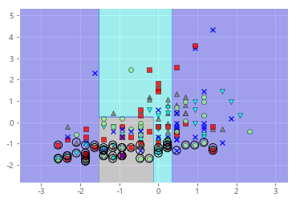

- 너무 불규칙하다.

#### 의사결정나무 

```python
draw_decision_tree(criterion_dtc)
```

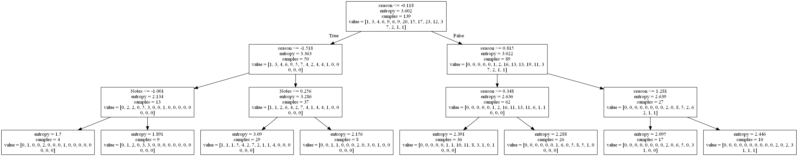

- 내가 만든 학습기가 이렇게 의사결정하였다.
- 이제 다른걸로도 예측해보고 파라미터도 바꾸고 변수도 추개해서 정확도를 높여보자.