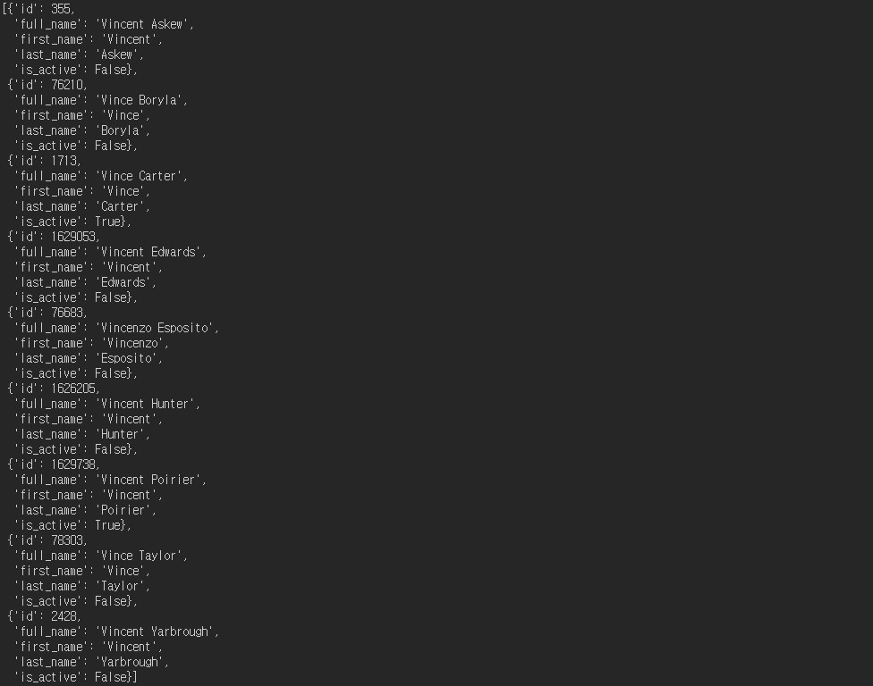
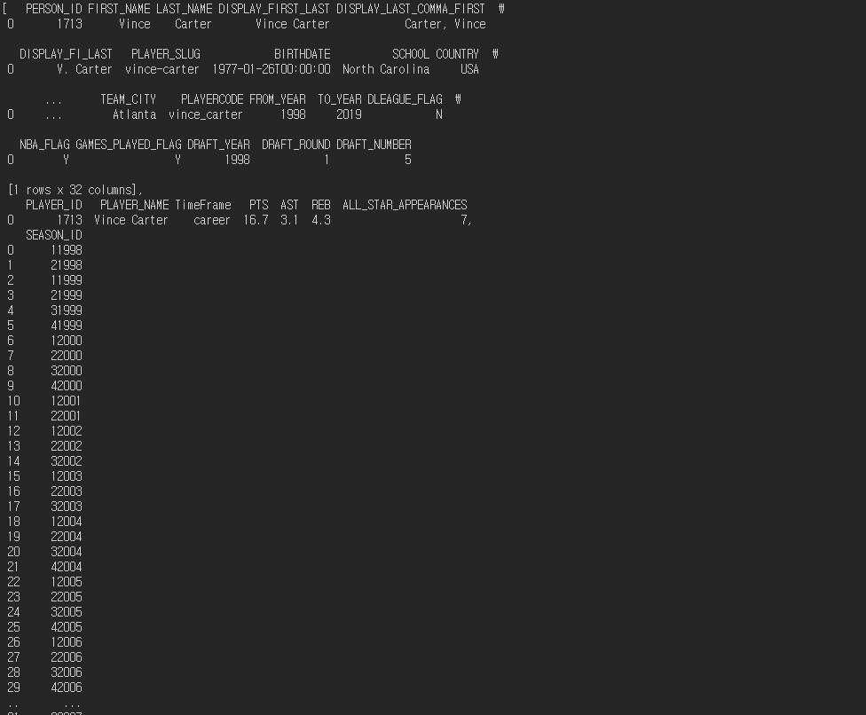
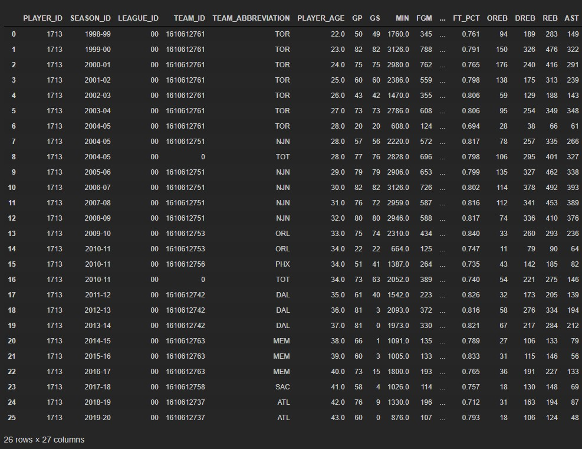

# 의사결정나무 예측

#### 필요한 패키지 import

```python
from sklearn.datasets import load_iris
from sklearn.tree     import DecisionTreeClassifier
from sklearn.model_selection import train_test_split, KFold, cross_val_score, cross_validate,  GridSearchCV
from sklearn.metrics import accuracy_score
from sklearn.preprocessing import StandardScaler

import sklearn
print(sklearn.__version__)
```

#### 데이터 준비

```python
nba_label = nba_injury_merge['age']
nba_data = nba_injury_merge.loc[:,['season','Notes']]

X_train, X_test, y_train, y_test =train_test_split(nba_data, nba_label, test_size = 0.2,  random_state=5)
```

- label은 은퇴나이고 data는 뛴 연도와 부상 횟수이다.
- 테스트와 트레인 데이터를 나눈다.

#### 예측해보기

```python
nba_dtc = DecisionTreeClassifier(random_state=5)
nba_dtc.fit(X_train, y_train)

nba_dtc_entropy = DecisionTreeClassifier(random_state=5, criterion='entropy')
nba_dtc_entropy.fit(X_train, y_train)

predition_gini = nba_dtc.predict(X_test)

predition_entropy = nba_dtc_entropy.predict(X_test)

print('예측 정확도 : %.2f' % accuracy_score(y_test, predition_gini))
print('예측 정확도 : %.2f' % accuracy_score(y_test, predition_entropy))

>
예측 정확도 : 0.26
예측 정확도 : 0.23
```

- gini와 entropy로 나누어서 예측해 보았다, 두 가지 모두 정확도가 굉장히 낮았다.

```python
nba_gini_pred = pd.DataFrame({
    '원래나이' : y_test,
    '예측나이': predition_gini
})
nba_gini_pred
```


- 거의 맞는게 없다.

### Kfold 추가해서 하기

```python
kfold = KFold(n_splits=5)
cv_accuracy = []
print('nba_data', nba_data.shape[0])

nba_label_arr = np.array(nba_label.tolist())
display(nba_label_arr)
nba_data_arr = np.array([[nba_data.get_value(i,'season'),nba_data.get_value(i,'Notes')] for i in nba_data.index])
display(nba_data_arr)

>
array([37, 41, 37, 36, 36, 38, 32, 36, 36, 37, 36, 40, 34, 38, 34, 34, 34,
       34, 38, 35, 38, 40, 34, 34, 34, 35, 38, 36, 32, 40, 30, 37, 35, 39,
       34, 33, 37, 34, 29, 38, 36, 35, 40, 37, 34, 33, 28, 38, 36, 34, 35,
       33, 34, 37, 33, 37, 30, 35, 36, 36, 33, 30, 41, 33, 29, 31, 35, 33,
       37, 35, 37, 29, 37, 31, 35, 33, 39, 37, 39, 37, 30, 37, 36, 36, 38,
       34, 31, 43, 37, 37, 32, 32, 36, 28, 30, 40, 33, 40, 37, 37, 34, 36,
       31, 34, 37, 37, 32, 31, 26, 31, 37, 37, 35, 35, 38, 35, 37, 31, 42,
       34, 32, 36, 29, 38, 35, 38, 30, 38, 31, 34, 35, 28, 36, 35, 36, 40,
       34, 34, 31, 31, 33, 32, 35, 39, 28, 37, 37, 41, 32, 33, 35, 35, 31,
       35, 28, 37, 27, 31, 32, 33, 34, 31, 31, 26, 30, 36, 35, 38, 33, 28,
       39, 38, 33])
array([[18., 50.],
       [16., 44.],
       [16., 43.],
       [14., 36.],
       [11., 35.],
       [ 9., 35.],
       [ 5., 34.],
       [12., 30.],
       [12., 28.]
```

- Kfold로 나누어서 더 세밀한 예측을 해보기로 하였다.
- 우선 array로 데이터를 바꾸었다.

#### 교차검증 정확도 확인하기

```python
n_iter = 0
for train_idx, test_idx in kfold.split(nba_data):
    X_train, X_test = nba_data_arr[train_idx],nba_data_arr[test_idx]
    y_train, y_test = nba_label_arr[train_idx], nba_label_arr[test_idx]

    # 학습을 진행하겠다면?
    nba_dtc.fit(X_train, y_train)
    # 예측
    fold_pred = nba_dtc.predict(X_test)
    
    # 정확도 측정
    n_iter += 1
    accuracy = np.round(accuracy_score(y_test, fold_pred),4)
    print('\n{}교차검증 정확도 :  {}, 학습 데이터 크기 : {}, 검증 데이터 크기 : {}'.format(n_iter, accuracy,X_train.shape[0], X_test.shape[0]))
    cv_accuracy.append(accuracy)
print('\n\n')
print('\n 평균 검증 정확도 : ', np.mean(cv_accuracy))   

>
1교차검증 정확도 :  0.1143, 학습 데이터 크기 : 138, 검증 데이터 크기 : 35

2교차검증 정확도 :  0.2571, 학습 데이터 크기 : 138, 검증 데이터 크기 : 35

3교차검증 정확도 :  0.1714, 학습 데이터 크기 : 138, 검증 데이터 크기 : 35

4교차검증 정확도 :  0.0882, 학습 데이터 크기 : 139, 검증 데이터 크기 : 34

5교차검증 정확도 :  0.0882, 학습 데이터 크기 : 139, 검증 데이터 크기 : 34

 평균 검증 정확도 :  0.14384000000000002
```

- 형편없는 정확도다.

### cross_validate로 해보기

> Kfold처럼 검증 가능

```python
scoring = cross_val_score(nba_dtc,nba_data_arr,nba_label_arr,scoring='accuracy',cv=3 )
print('교차 검증별 정확도 :',scoring)
print('평균 검증 정확도 :',np.mean(scoring))
>
교차 검증별 정확도 : [0.22413793 0.24137931 0.12280702]
평균 검증 정확도 : 0.19610808630772336
```

- 어째 정확도가 마음에 들지 않는다.

```python
scoring2 = cross_validate(nba_dtc,nba_data_arr,nba_label_arr,scoring='accuracy',cv=10)
print('교차 검증 정보 :',scoring2)
print('교차 검증별 정확도 :',scoring2['test_score'])
print('교차 검증 시간 :',scoring2['fit_time'])
print('평균 검증 정확도 :',np.mean(scoring2['test_score']))

>
교차 검증 정보 : {'fit_time': array([0.00099874, 0.00099587, 0.        , 0.00199699, 0.00199533,
       0.0009973 , 0.0010004 , 0.00199723, 0.        , 0.00099063]), 'score_time': array([0.0009973 , 0.        , 0.00099754, 0.        , 0.        ,
       0.        , 0.        , 0.        , 0.0010047 , 0.        ]), 'test_score': array([0.22222222, 0.38888889, 0.33333333, 0.17647059, 0.23529412,
       0.11764706, 0.05882353, 0.05882353, 0.29411765, 0.11764706])}
교차 검증별 정확도 : [0.22222222 0.38888889 0.33333333 0.17647059 0.23529412 0.11764706
 0.05882353 0.05882353 0.29411765 0.11764706]
교차 검증 시간 : [0.00099874 0.00099587 0.         0.00199699 0.00199533 0.0009973
 0.0010004  0.00199723 0.         0.00099063]
평균 검증 정확도 : 0.20032679738562092
```

- 교차 검증의 정보들을 확인하고 정확도도 확인해보았다.

###  GridSearchCV로 해보기

```python
gscv_tree = DecisionTreeClassifier(random_state=20)
params = {'criterion' : ['gini', 'entropy'], 
          'splitter' : ['random','best'], 
          'max_depth' : [1,2,3], 
          'min_samples_split' : [2,3]}

grid_gscv_tree = GridSearchCV(gscv_tree, param_grid = params,cv=3,refit=True )

grid_gscv_tree.fit(X_train, y_train)
grid_gscv_tree.cv_results_
score_df = pd.DataFrame(grid_gscv_tree.cv_results_)

print('최적의 파라미터 : ', grid_gscv_tree.best_params_)
print('높은 정확도 : ', grid_gscv_tree.best_score_)

>
최적의 파라미터 :  {'criterion': 'gini', 'max_depth': 3, 'min_samples_split': 2, 'splitter': 'random'}
높은 정확도 :  0.2086031452358927
```

- 옵션들을 튜닝하여 적용하였다.

- 그런다음 최적의 파라미터를 찾고 높은 정확도를 확인하였다.

#### 위의 옵션들을 적용하여 학습하기

```python
estimator = grid_gscv_tree.best_estimator_
prediction = estimator.predict(X_test)
print('answer : ', y_test)
print('guess : ', prediction)
print('테스트 세트의 정확도 : ', accuracy_score(y_test,prediction))

>
answer :  [31 33 32 35 39 28 37 37 41 32 33 35 35 31 35 28 37 27 31 32 33 34 31 31
 26 30 36 35 38 33 28 39 38 33]
guess :  [36 30 30 30 39 30 37 30 39 36 30 36 31 31 36 31 30 31 31 30 30 30 30 30
 31 31 31 30 36 36 31 31 31 31]
테스트 세트의 정확도 :  0.11764705882352941
```

- 정확도는 포기하고 다양한 학습기를 돌려보기로 하였다.

### 표준화하여 적용하기

```python
sc = StandardScaler()
sc.fit(X_train)

X_train_std = sc.transform(X_train) #트레이닝 데이터의 표준화
X_test_std = sc.transform(X_test) # 테스트 데이터의 표준화

criterion_dtc = DecisionTreeClassifier(criterion='entropy', max_depth=3, random_state=0)
# 표준화 작업 했으면 표준화 된 데이터를 넣는다.
criterion_dtc.fit(X_train_std, y_train)

y_pred = criterion_dtc.predict(X_test_std)
print('총 테스트 개수 : %d, 오류의 개수 : %d' % ( len(y_test), (y_test != y_pred).sum()) )
print('정확도 : %.2f' % accuracy_score(y_test, y_pred))

>
총 테스트 개수 : 34, 오류의 개수 : 25
정확도 : 0.26
```

- 표준화하여 다시 재구성하여 예측하였다. 정확도가 사알짝 올랐다.

### 이미지로 보기

```python
from matplotlib.colors import ListedColormap
import matplotlib.pyplot as plt

import matplotlib as mpl
import matplotlib.pyplot as plt
%matplotlib inline

import platform

from matplotlib import font_manager, rc
# plt.rcParams['axes.unicode_minus'] = False

if platform.system() == 'Darwin':
    rc('font', family='AppleGothic')
elif platform.system() == 'Windows':
    path = "c:/Windows/Fonts/malgun.ttf"
    font_name = font_manager.FontProperties(fname=path).get_name()
    rc('font', family=font_name)
else:
    print('Unknown system... sorry~~~~') 
    
    
import seaborn as sns

import matplotlib
matplotlib.rcParams['axes.unicode_minus'] = False


def plot_decision_regions(X, y, classifier, test_idx=None, resolution=0.02):

    # 마커와 컬러맵을 설정합니다.
    markers = ('s', 'x', 'o', '^', 'v',
              's', 'x', 'o', '^', 'v',
              's', 'x', 'o', '^', 'v',
              's', 'x', 'o')
    colors = ('red', 'blue', 'lightgreen', 'gray', 'cyan',
             'red', 'blue', 'lightgreen', 'gray', 'cyan',
             'red', 'blue', 'lightgreen', 'gray', 'cyan',
             'red', 'blue', 'lightgreen')
    cmap = ListedColormap(colors[:len(np.unique(y))])

    # 결정 경계를 그립니다.
    x1_min, x1_max = X[:, 0].min() - 1, X[:, 0].max() + 1
    x2_min, x2_max = X[:, 1].min() - 1, X[:, 1].max() + 1
    xx1, xx2 = np.meshgrid(np.arange(x1_min, x1_max, resolution),
                           np.arange(x2_min, x2_max, resolution))
    Z = classifier.predict(np.array([xx1.ravel(), xx2.ravel()]).T)
    Z = Z.reshape(xx1.shape)
    plt.contourf(xx1, xx2, Z, alpha=0.3, cmap=cmap)
    plt.xlim(xx1.min(), xx1.max())
    plt.ylim(xx2.min(), xx2.max())

    for idx, cl in enumerate(np.unique(y)):
        plt.scatter(x=X[y == cl, 0], 
                    y=X[y == cl, 1],
                    alpha=0.8, 
                    c=colors[idx],
                    marker=markers[idx], 
                    label=cl, 
                    edgecolor='black')

    # 테스트 샘플을 부각하여 그립니다.
    if test_idx:
        X_test, y_test = X[test_idx, :], y[test_idx]

        plt.scatter(X_test[:, 0],
                    X_test[:, 1],
                    facecolors='none',
                    edgecolor='black',
                    alpha=1.0,
                    linewidth=1,
                    marker='o',
                    s=100, 
                    label='test set')
```

```python
import io
import pydot
from IPython.core.display import Image
from sklearn.tree import export_graphviz

def draw_decision_tree(model):
    dot_buf = io.StringIO()
    export_graphviz(model, out_file=dot_buf, feature_names=['season','Notes'])
    graph = pydot.graph_from_dot_data(dot_buf.getvalue())[0]
    image = graph.create_png()
    return Image(image)
```

### 불순도 검사와 의사결정나무 이미지

#### 불순도 검사

```python
x_combind_std = np.vstack((X_train_std, X_test_std))
y_combind = np.hstack((y_train, y_test))
plot_decision_regions(X=x_combind_std,y=y_combind,classifier=criterion_dtc,test_idx=range(122,172))
```


- 너무 불규칙하다.

#### 의사결정나무 

```python
draw_decision_tree(criterion_dtc)
```


- 내가 만든 학습기가 이렇게 의사결정하였다.
- 이제 다른걸로도 예측해보고 파라미터도 바꾸고 변수도 추개해서 정확도를 높여보자.

### 포지션 변수 추가

- 데이터 인코딩을 추가하여 예측하기 위하여 포지션을 추가하기로 함. 데이터를 추가로 구하기로 함
- NBA-API를 사용하기로 결정

#### nba-api 설치

```python
!pip install nba_api
```

#### 선수 찾기

```python
from nba_api.stats.static import players
from nba_api.stats.endpoints import commonplayerinfo,playercareerstats

df = players.find_players_by_first_name("vince")
```

- 선수의 앞자리로 찾거나 뒷자리로 찾을 수 있다. 다양한 방법이 있다.



- 그럼 해당하는 선수의 내역이 쫙 나온다. 영서 id를 가지고 찾아보자.

#### id로 찾기

```python
player_info = commonplayerinfo.CommonPlayerInfo(player_id=1713)
player = player_info.get_data_frames()
player
```



- 그럼 이렇게 선수 정보를 보여준다. 내가 원하는 포지션이 없어서 다른것도 찾아보았다.

```python
career = playercareerstats.PlayerCareerStats(player_id='1713')
game_data = career.get_data_frames()
game_data[0]
```



- 이렇게 찾으면 다양한 정보가 있어서 포지션도 있을 줄 알았는데 없었다. 

```python
game_data[0].columns

>

Index(['PLAYER_ID', 'SEASON_ID', 'LEAGUE_ID', 'TEAM_ID', 'TEAM_ABBREVIATION',
       'PLAYER_AGE', 'GP', 'GS', 'MIN', 'FGM', 'FGA', 'FG_PCT', 'FG3M', 'FG3A',
       'FG3_PCT', 'FTM', 'FTA', 'FT_PCT', 'OREB', 'DREB', 'REB', 'AST', 'STL',
       'BLK', 'TOV', 'PF', 'PTS'],
      dtype='object')
```

[nba-api 깃허브 링크](https://github.com/swar/nba_api)

- 여기 들어가서 자세하게 더 찾아서 다시 가져와야겠다.