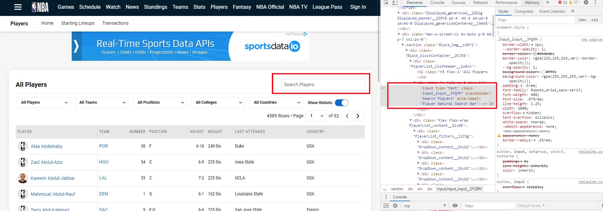
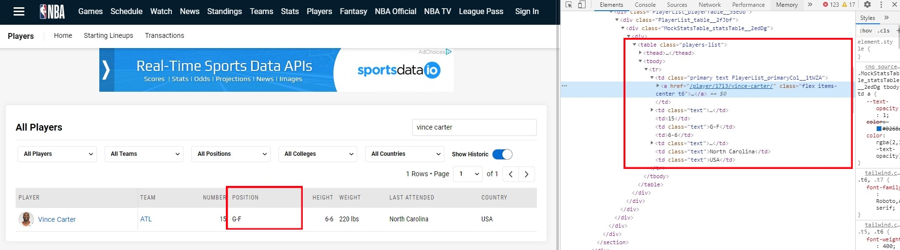
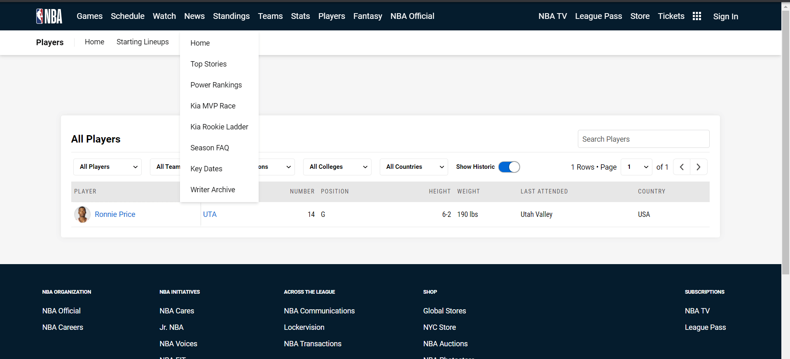
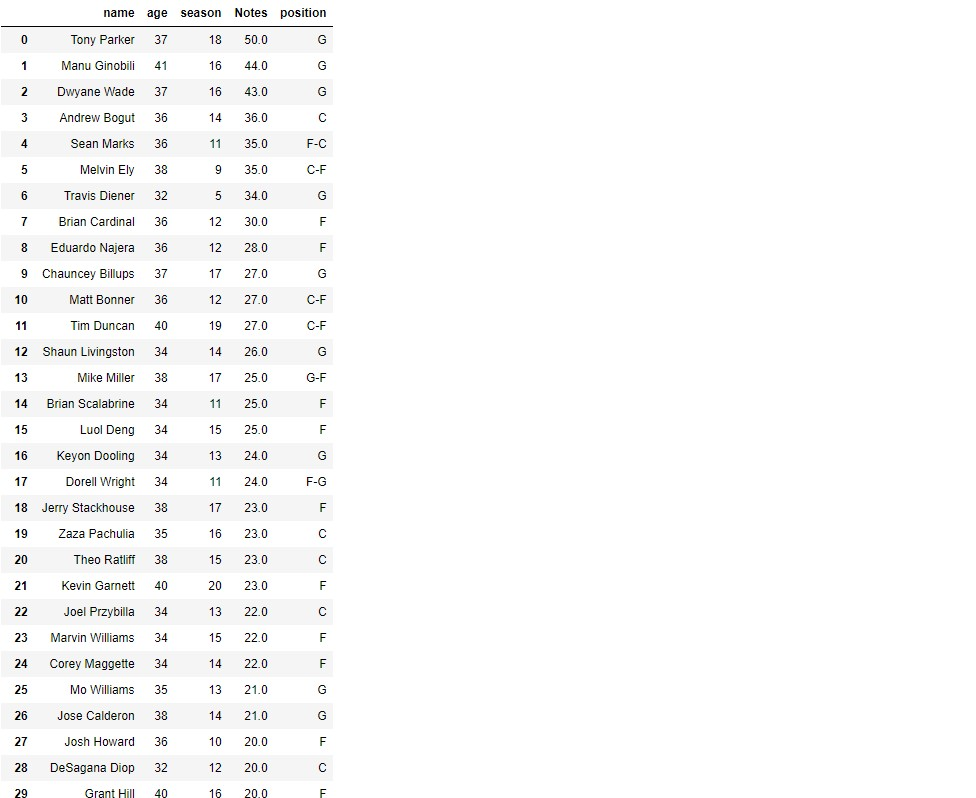

# NBA 선수 은퇴나이 예측해보기_03

### 포지션 크롤링

- nba-api에서 포지션을 뽑아오려고 했는데 아무리 찾아봐도 안 보여서 그냥 홈페이지에서 크롤링하기로 하였다.

```python
position_name = list(nba_injury_merge['name'])
position_name
```

- 우선 선수이름을 리스트로 만든다.

```python
position_dic = {}
for name in position_name:
    position_dic[name] = 0
position_dic
```

- 그 다음에 딕셔너리로 만들어서 관리한다.

```python
driver.get('https://www.nba.com/players')
page = driver.find_elements_by_css_selector('.Toggle_slider__hCMQQ')[0].click()
key_words = driver.find_elements_by_css_selector('.Input_input__3YQfM')[0]
for names in list(position_dic.keys()):
    try:
        key_words.send_keys(names)
        time.sleep(1)
        position_table = driver.find_elements_by_css_selector('.players-list')[0]
        position_tr = position_table.find_elements_by_tag_name('tr')[1]
        position_td = position_tr.find_elements_by_tag_name('td')[3].text
        position_dic[names] = position_td
        print(position_td)
        key_words.clear()
        time.sleep(1)
    except:
        position_dic[names] = 0
```

- 중간에 오류가 나서 try랑 except로 관리하였다.


- 모든 선수들을 보려면 저 버튼을 클릭해야 한다.

`page = driver.find_elements_by_css_selector('.Toggle_slider__hCMQQ')[0].click()` 그래서 찾아서 클릭한다.



- 그 다음에 저기에 선수이름을 입력하면 선수의 목록이 뜬다.

```python
# 인풋태그 찾기
key_words = driver.find_elements_by_css_selector('.Input_input__3YQfM')[0]
# 선수이름을 for문으로 돌려서 입력하기
for names in list(position_dic.keys()):
    try:
        #선수 이름을 input에 입력해서 보내기
        key_words.send_keys(names)
        time.sleep(1)
```



- 그런다음 포지션이 있는 태그를 찾아서 text만 받아서 딕셔너리를 업데이트 시킨다.

```python
		position_tr = position_table.find_elements_by_tag_name('tr')[1]
    	# 포지션 인덱스 찾기
        position_td = position_tr.find_elements_by_tag_name('td')[3].text
        # 딕셔너리 업데이트
        position_dic[names] = position_td
        print(position_td)
        # 다음 선수입력을 위해 원래있던 이름 지우기
        key_words.clear()
        time.sleep(1)
    except:
        position_dic[names] = 0
```



- 작동시키면 이렇게 진행된다.

```python
for key, value in position_dic.items():
    if value == 0:
        print(key)
```

- 마지막으로 입력안된 선수가 있는지 최종확인한다.

#### df와 합치기

```python
nba_injury_merge['position'] = nba_injury_merge['name'].apply(lambda x:posi(x,position_dic))
nba_injury_merge
```



- 이렇게 업데이트 되었다. csv로 저장하자.

```python
nba_injury_merge.to_csv('nba_injury_merge_position.csv',mode='w',index=False)
```

