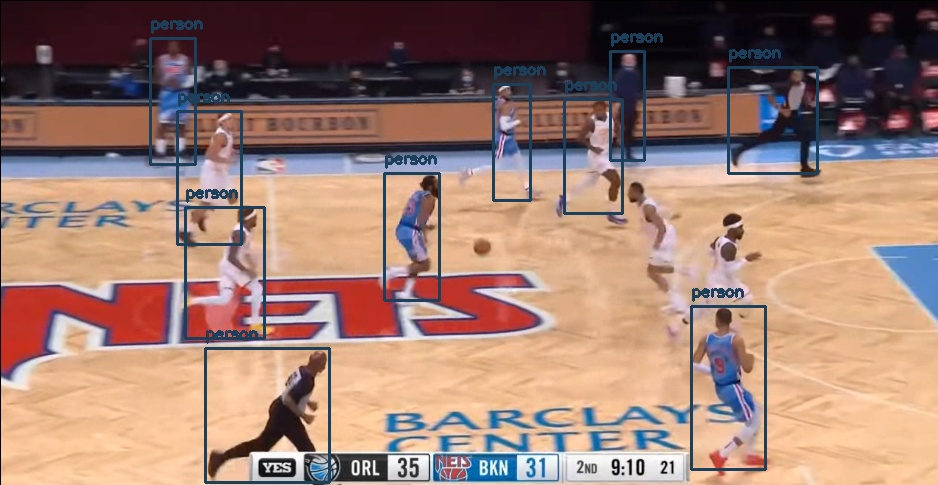
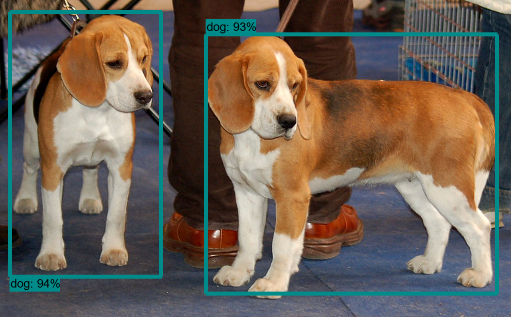
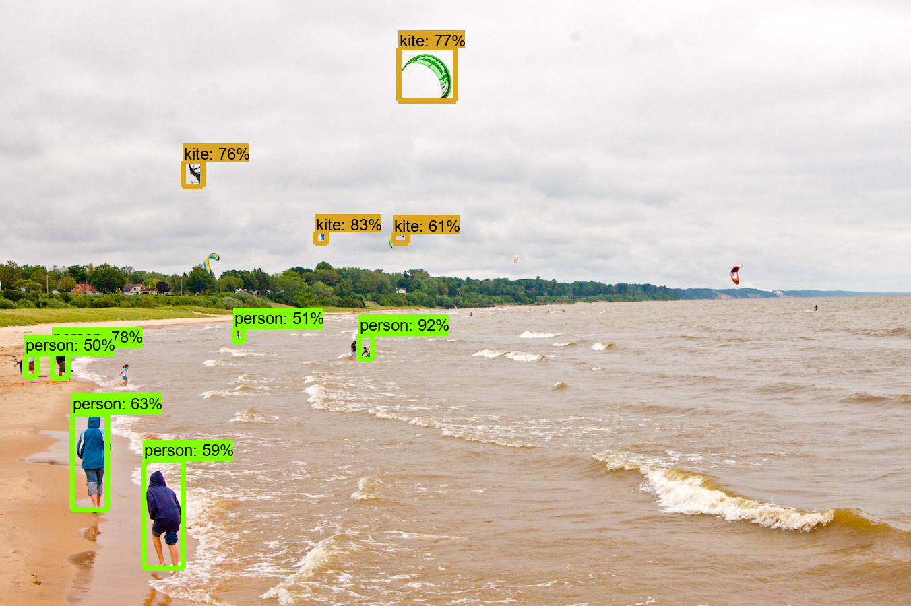
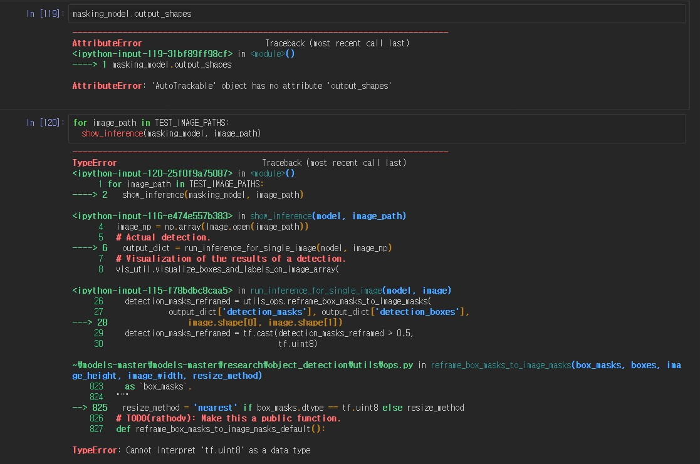
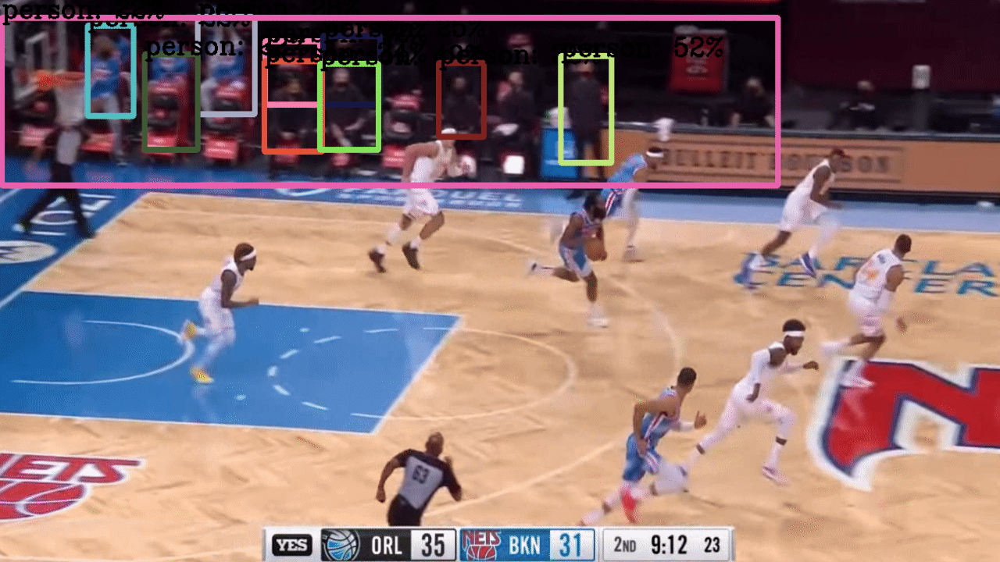
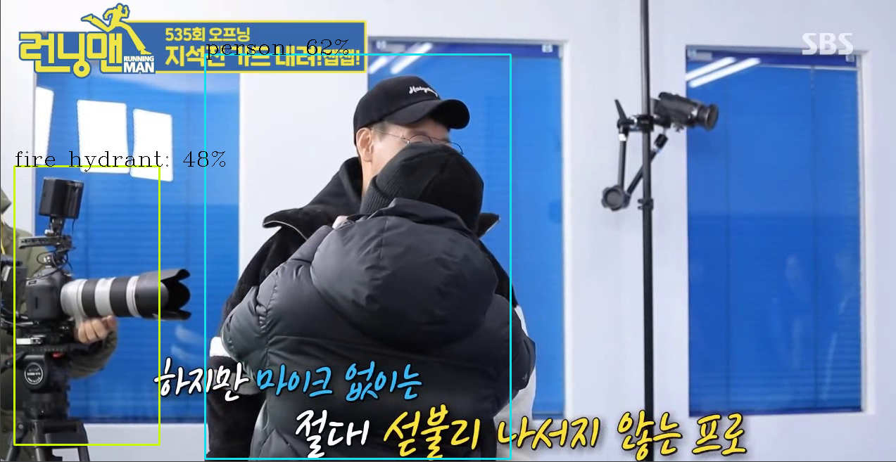

# 농구영상 득점 자동 판별기 만들기

[코드 참고 사이트](https://bskyvision.com/678)

```python
import cvlib as cv
from cvlib.object_detection import draw_bbox

image_path = 'ball.PNG' 
im = cv2.imread(image_path)

bbox, label, conf = cv.detect_common_objects(im)

print(bbox, label, conf)

im = draw_bbox(im, bbox, label, conf) 

cv2.imwrite('result.jpg', im) 
```



- 이 사진처럼 사람을 식별하고 공을 식별해서 자동으로 득점을 기록하고 어떤 선수가 넣었는지 기록하는 것을 만들어보려고 한다.
- 이것은 사진이라 이렇게 판별이 가능한 것이고 영상으로는 다음의 링크를 참고해서 하려고 한다.

[영상코드 참고사이트1](https://m.blog.naver.com/PostView.nhn?blogId=gyurse&logNo=221182329076&proxyReferer=https:%2F%2Fwww.google.co.kr%2F)

[영상코드 참고 사이트2](https://hwangpy.tistory.com/3)

#### 데모 실행해보기

- tutorial 실행하는데 경로 설정하는게 가장 힘들었다. 참고 해서 정상적으로 만들때는 바꿔야겠다.
- 코드 분석이 더 필요하다. 그냥 하는것보다 분석해서 하는게 나중에 큰 도움이 될 것 같다.





- 실행하면 요로코롬 나온다.



- 마지막 부분에서 이러한 오류가 발생하여 잡기로 해결방법을 찾으려고 한다.

#### 오류 잡기

- 텐서플로의 2.x버전의 문제로 1.x 버전을 사용하면 된다고 나와있다.

[오류 깃 링크](https://github.com/tensorflow/models/issues/9304)

```python
!pip uninstall tensorflow
!pip install tensorflow==1.15
```

- 기존의 텐서플로우를 삭제하고 다시 1.x버전으로 설치한다.
- 예전에는 2.x버전에서도 자동으로 변환?같이 해줘서 실행되었다는데 요즘은 안 되는것 같다.

- uninstall이 안 될경우 그냥 install을 해도 설치가 되었다.

```python
model_name = 'ssd_mobilenet_v1_coco_2017_11_17'
detection_model = load_model(model_name)
```

- 이 부분에서 오류가 나서 다시 2.x버전으로 위의 오류를 해결할 방법을 찾아보자.
- 코랩으로 돌려야하는것 같아서 코랩으로 돌려보려고 한다. 지금까지는 주피터에서 작업하였다.

#### tensorflow-gpu깔기

- cpu버전과 gpu버전이 있어서 gpu버전도 설치하였다. 거의 4~5시간정도 걸렸다.
  - 밤새 켜놓았는데도 다 안껼려서 그냥 꺼버렸다.

#### 다른 코드 구동하기

```python
import numpy as np
import os
import six.moves.urllib as urllib
import sys
import tarfile
import tensorflow as tf
import cv2

import tensorflow.compat.v1 as tf 

tf.disable_v2_behavior()

 
# This is needed since the notebook is stored in the object_detection folder.
sys.path.append("..")
 
from utils import label_map_util
from utils import visualization_utils as vis_util
 
tf.reset_default_graph()
tf.get_default_graph()
 
# What model to download.
MODEL_NAME = 'ssd_mobilenet_v1_coco_11_06_2017'
MODEL_FILE = MODEL_NAME + '.tar.gz'
DOWNLOAD_BASE = 'http://download.tensorflow.org/models/object_detection/'
 
# Path to frozen detection graph. This is the actual model that is used for the object detection.
PATH_TO_CKPT = MODEL_NAME + '/frozen_inference_graph.pb'
 
# List of the strings that is used to add correct label for each box.
PATH_TO_LABELS = os.path.join('data', 'mscoco_label_map.pbtxt')
 
NUM_CLASSES = 90
 
opener = urllib.request.URLopener()
opener.retrieve(DOWNLOAD_BASE + MODEL_FILE, MODEL_FILE)
tar_file = tarfile.open(MODEL_FILE)
 
for file in tar_file.getmembers():
    file_name = os.path.basename(file.name)
    if 'frozen_inference_graph.pb' in file_name:
        tar_file.extract(file, os.getcwd())
 
detection_graph = tf.Graph()
with detection_graph.as_default():
    od_graph_def = tf.GraphDef()
    with tf.gfile.GFile(PATH_TO_CKPT, 'rb') as fid:
        serialized_graph = fid.read()
        od_graph_def.ParseFromString(serialized_graph)
        tf.import_graph_def(od_graph_def, name='')
        
label_map = label_map_util.load_labelmap(PATH_TO_LABELS)
categories = label_map_util.convert_label_map_to_categories(label_map, max_num_classes=NUM_CLASSES, use_display_name=True)
category_index = label_map_util.create_category_index(categories)
 
def load_image_into_numpy_array(image):
  (im_width, im_height) = image.size
  return np.array(image.getdata()).reshape((im_height, im_width, 3)).astype(np.uint8)
  
# Size, in inches, of the output images.
IMAGE_SIZE = (12, 8)
 
with detection_graph.as_default():
    with tf.Session(graph=detection_graph) as sess:
#         cam = cv2.VideoCapture(0)
        cam = cv2.VideoCapture('./img2/nba_sample2.mp4')
        
        while True:
            ret_val, image = cam.read()
            
            if ret_val:
                # Expand dimensions since the model expects images to have shape: [1, None, None, 3]
                image_np_expanded = np.expand_dims(image, axis=0)
                image_tensor = detection_graph.get_tensor_by_name('image_tensor:0')
                
                # Each box represents a part of the image where a particular object was detected.
                boxes = detection_graph.get_tensor_by_name('detection_boxes:0')
                
                # Each score represent how level of confidence for each of the objects.
                # Score is shown on the result image, together with the class label.
                scores = detection_graph.get_tensor_by_name('detection_scores:0')
                classes = detection_graph.get_tensor_by_name('detection_classes:0')
                num_detections = detection_graph.get_tensor_by_name('num_detections:0')
                
                # Actual detection.
                (boxes, scores, classes, num_detections) = sess.run(
                        [boxes, scores, classes, num_detections],
                        feed_dict={image_tensor: image_np_expanded})
                
                # Visualization of the results of a detection.
                vis_util.visualize_boxes_and_labels_on_image_array(
                        image,
                        np.squeeze(boxes),
                        np.squeeze(classes).astype(np.int32),
                        np.squeeze(scores),
                        category_index,
                        use_normalized_coordinates=True,
                        line_thickness=8)
               
            
                
                cv2.imshow('my webcam', image)
                
                if cv2.waitKey(1) == 27: 
                    break  # esc to quit
        
        cv2.destroyAllWindows()

```

- import tensorflow.compat.v1 as tf 
  - 이 코드를 넣어서 구동하게 만들었다.
  - 실제로 웹캠이 켜지고 사람이라고 인식하고 휴대폰도 cell phone이라고 인식한다.
  - 웹캠으로 지정된 부분을 수정하여 영상으로 바꿔서 시도하려고 한다.
  - 이거하려고 거의 하루 넘게 걸린것 같다 ㅠㅠㅠ
  - 더 많이 공부해야겠다.

### 동영상 인식 성공


- 원하는 그림이었지만 전부 사람으로 인식 못하고 몇명만 인식하는 수준이다. 또한 공을 인식못해서 더 찾아봐야겠다. 다른 파일들오 실행하려고 하는을 만들어서 하던가 다른 코드를 찾던가 더 깊게 파든가 암튼 뭘 해야겠다.

### yolo로 돌려보기

[참고블로그](https://diy-project.tistory.com/124)

이 블로그를 참고해서 작성하였다.

- 주피터대신 파이참으로 실행하였다.



- 위에 있는 코드보다 길이도 짧고 사람도 더 많이 인식한다. 그러나 벤치쪽에 있는 사람들만 인식하고 밑에 코드에서 뛰는 사람들은 전혀 인식을 못한다. 
- 또한 너무 느리다. 노트북 사양때문에 그런가....
  - 이건 cpu로 사용해서 그렇다는것 같다. 아마 gpu를 따로 설정해야하나보다.
- 그 이유를 찾아서 바꾸어보려고한다.
- 런닝맨 영상으로 실험해보았다.



- 카메라를 소화전으로 인식한다. 그래도 사람이나 다른 물체들은 잘 인식했다.