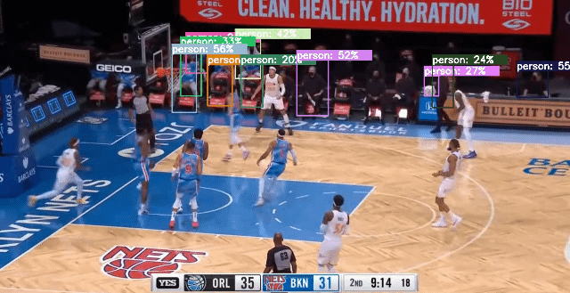

# 농구영상 득점 자동 판별기 만들기_02

### 텍스트 라벨 수정

````python
import cv2
from darkflow.net.build import TFNet
import numpy as np
import time
from PIL import ImageFont, ImageDraw, Image


font = ImageFont.truetype("./fontzip/NanumSquareB.ttf", 10)


options = {
    'model': 'cfg/yolo.cfg',
    'load': 'bin/yolo.weights',
    'threshold': 0.2,
    'gpu': 1.0
}

tfnet = TFNet(options)
colors = [tuple(255 * np.random.rand(3)) for _ in range(10)]


# capture = cv2.VideoCapture(0)
capture = cv2.VideoCapture('nba_sample.mp4')
capture.set(cv2.CAP_PROP_FRAME_WIDTH,1280)
capture.set(cv2.CAP_PROP_FRAME_HEIGHT, 720)
# capture.set(cv2.CAP_PROP_FPS, int(60))

width = capture.get(cv2.CAP_PROP_FRAME_WIDTH)
height = capture.get(cv2.CAP_PROP_FRAME_HEIGHT)
fourcc = cv2.VideoWriter_fourcc(*'DIVX')
out = cv2.VideoWriter('output.avi', fourcc, 30.0, (int(width), int(height)))

prev_time = 0
FPS = 10

while True:
    # stime = time.time()
    ret, frame = capture.read()
    current_time = time.time() - prev_time
    if(ret is True) and (current_time > 1./ FPS):
        prev_time = time.time()
        results = tfnet.return_predict(frame)
        for color, result in zip(colors, results):
            tl = (result['topleft']['x'], result['topleft']['y'])
            br = (result['bottomright']['x'], result['bottomright']['y'])
            label = result['label']
            confidence = result['confidence']
            text = '{}: {:.0f}%'.format(label, confidence * 100)
            frame = cv2.rectangle(frame, tl, br, color, 2)

            text_size = cv2.getTextSize(text=text, fontFace=cv2.FONT_HERSHEY_SIMPLEX, fontScale=1, thickness=2)
            text_width, text_height = text_size[0][0], text_size[0][1]
            cv2.rectangle(frame, pt1=(result['topleft']['x']-1, result['topleft']['y'] - text_height), pt2=(result['topleft']['x']-30 + text_width, result['topleft']['y']), color=color, thickness=-1)
            frame = cv2.putText(
                frame, text, (result['topleft']['x'], result['topleft']['y']-4), cv2.FONT_HERSHEY_SIMPLEX, 0.7, (255, 255, 255), 2)
        cv2.imshow('frame', frame)
        out.write(frame)
        print('FPS {:.1f}'.format(1 / (time.time() - prev_time)))
    if cv2.waitKey(1) & 0xFF == ord('q'):
        break

capture.release()
out.release()
cv2.destroyAllWindows()
````

#### 추가한 부분

```python
from PIL import ImageFont, ImageDraw, Image

font = ImageFont.truetype("./fontzip/NanumSquareB.ttf", 10)

text_size = cv2.getTextSize(text=text, fontFace=cv2.FONT_HERSHEY_SIMPLEX, fontScale=1, thickness=2)
text_width, text_height = text_size[0][0], text_size[0][1]
cv2.rectangle(frame, pt1=(result['topleft']['x']-1, result['topleft']['y'] - text_height), pt2=(result['topleft']['x']-30 + text_width, result['topleft']['y']), color=color, thickness=-1)
```

- 우선 font가 마음에 들지 않아 바꿨고 텍스트의 크기를 받아서 박스의 크기를 설정해준다.

#### 수정한 부분

```python
frame = cv2.putText(
                frame, text, (result['topleft']['x'], result['topleft']['y']-4), cv2.FONT_HERSHEY_SIMPLEX, 0.7, (255, 255, 255), 2)
```

- 텍스트의 위치를 조금 수정하였다. y좌표가 밑으로 쳐지는 경향이 있어서 박스안에 들어오게 바꾸었다. 글자색도 흰색으로 변경하였고 크키고  글씨 크기도 조금 줄였다.



- 저번보다 보기에 편해졌다. 글씨체좀 동글동글하게 바꾸고 해상도도 바꿔야겠다.
- 더 찾아봐야겠다. 이미지 예시는 있는데 puttext는 안보여서 더 찾아보려고 한다.

