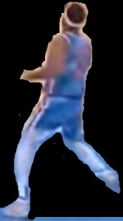

# basketballVideoAnalysis 오픈소스 해보기

https://github.com/stephanj/basketballVideoAnalysis

- 해당 깃허브에 있는 거 분석하고 해보기로 함

## color-detection


```python
#!/bin/bash
python show_colors.py -p images
```

- run.sh 파일을 실행하면 show_colors.py가 실행됨

- path는 이미지가 있는 폴더 지정 

  - image2라는 폴더를 새로 생성하고 path 변경

  - ```python
    #!/bin/bash
    python show_colors.py -p images2ㅇ
    ```

  - 

  - 우선 한 장으로 시도

```
team,red,green,blue,percentage

team_a_1.jpg,1,0,1,67

team_a_1.jpg,86,99,141,20

team_a_1.jpg,157,165,201,12
```

- 다음과 같은 결과값이 csv 파일로 저장됨

- 5명씩 만들어서 진행해보려고 함

- https://www.linkedin.com/pulse/sports-video-analysis-using-machine-learning-stephan-janssen/
  - 이 프로젝트 주인이 상세하게 알려준 것 
  - 이거대로 따라해보자

### 1번 court_dection

- README에 보면 court_detection1.py보다 opencv를 이용한 코드를 사용하였다. 
- 그래서 이 함수를 어떻게 써야 하는지 찾아보고 있다.
  - ​	그냥 코드만 봐서는 어떻게 실행해야 할지 감이 안온다.
- 우선 court_detection1.py에서 좌표를 찾고 나서 그 안에 부분을 흰색으로 나머지를 검은색으로 칠하는 것이 2번째 방법인 것 같다.
- court_detection1.py에서 좌표를 나타내는 부분을 찾아서 실행해보자.

