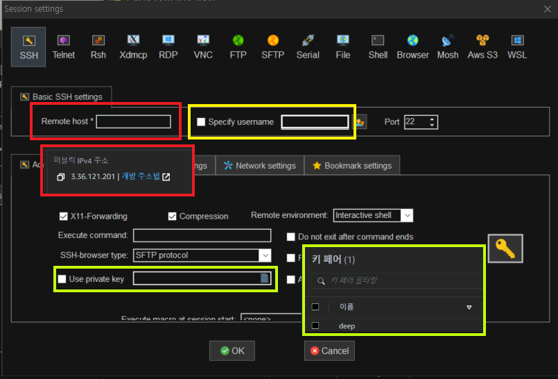
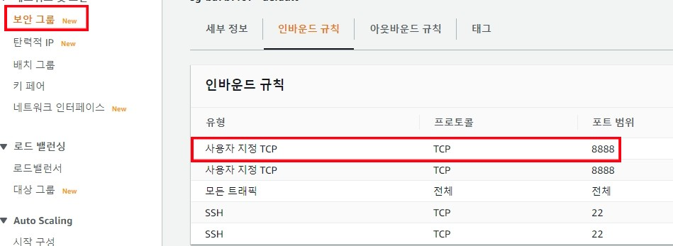

# 아마존 AWS E2C 스팟인스턴스 사용하기

- 결국 아마존 서버를 사용해서 딥러닝을 사용하기로 결정
- 시간 단위로 사용하는게 가장 좋을 것 같아서 스팟인스턴스 환경 구축 충

#### 스팟인스턴스 생성


- 스팟인스터스를 요청해서 스팟인스턴스를 생성하였다.

- 최대하격은 $0.9이고 처음 입찰가격은 &0.27이었다. 아주 저렴한 비용으로 서버를 받았다.^^

- 그러나 볼륨생성 과정에서 capacity-not-available이라고 나와서 방법을 찾고있다.

- 지역을 서울로 바꾸니 되었다. 아마 인스턴스 신청 과정에서 뭐가 꼬인것 같다.

### mobaxterm과 ssh 연결하기

#### 1. SSH에 입력하기


#### 2. 필요한 정보 입력



1. Remote host에는 퍼플릭 주소를 입력하고 use private key에는 다운받은 ppk파일을 넣는다.
2.  sepcify에는 다음과 같이 해당되는 것을 입력한다.

```
인스턴스를 시작하는 데 사용한 AMI의 기본 사용자 이름을 가져옵니다.

Amazon Linux 2 또는 Amazon Linux AMI의 경우 사용자 이름은 ec2-user입니다.

CentOS AMI의 경우 사용자 이름은 centos입니다.

Debian AMI의 경우 사용자 이름은 admin입니다.

Fedora AMI의 경우 사용자 이름은 ec2-user 또는 fedora입니다.

RHEL AMI의 경우 사용자 이름은 ec2-user 또는 root입니다.

SUSE AMI의 경우 사용자 이름은 ec2-user 또는 root입니다.

Ubuntu AMI의 경우 사용자 이름은 ubuntu입니다.
```

그리고 ok를 누르면 만들어진다.

#### 보안 그룹에서 8888포트 추가



- 역서 8888포트를 추가해줘야 주피터 노트북과 연결된다.

### 주피터노트북에서 실행하기

```
jupyter notebook --ip 0.0.0.0
```

- 우선 주피터노트북으로 실행하려고 하니 에러가 발생해서 `!python video.py` 로 실행했다.
  - 그랬더니 tensorflow에서 뭘 지원하지 않는다고 나와서 다시 설정해야겠다.
- 또한 영구저장소 볼륨으로 연결해서 거기서 파일을 다운받으려고 하니 퍼미션 디나이가 떴다.
  - 이것도 해결해야하는 문제다.ㅠㅠㅠ
- tensorflow를 1.x로 낮추면 cudnn에서 문제가 발생하고 2.x로 설치하면 con~가 실행이 안 된다.... aws에서 tensor설정하는 법을 찾아서 조정하고 다시 실행하자.
- 볼륨연결도 잘 되고 착착 진행되는것 같았는데 다른 오류가 발생했다ㅠ 연결하기 힘들당

### 지속적으로 저장할 볼륨 연결

- 볼륨 연결 시 dev/xvdf 라고 명시적으로 해주니 잘 연결되었다.
- 또한 `sudo su`를 입력하니 잘 되었다.
- `exit` 로 탈출한다.