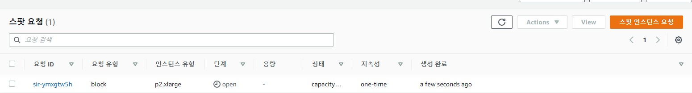

# 아마존 AWS 사용하기

- 결국 아마존 서버를 사용해서 딥러닝을 사용하기로 결정
- 시간 단위로 사용하는게 가장 좋을 것 같아서 스팟인스턴스 환경 구축 충

#### 스팟인스턴스 생성

- 스팟인스터스를 요청해서 스팟인스턴스를 생성하였다.

- 최대하격은 $0.9이고 처음 입찰가격은 &0.27이었다. 아주 저렴한 비용으로 서버를 받았다.^^

- 그러나 볼륨생성 과정에서 capacity-not-available이라고 나와서 방법을 찾고있다.