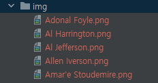

# NBA 선수 은퇴 나이 예측하기 장고 프로젝트

- 우선 리액트로 구조를 잡았으니 api를 먼저 구축하여 데이터를 가져오려고 한다.

- 작업 순서는 아래와 같이 진행하려고 한다.

  1. 모델 생성하기
  2. api 생성하기
  3. 선수들 이미지 사진 저장
  4. 테스트 케이스 생성
  5. 깃허브 액션 자동화
  6. pythonanywhere연동
  7. 기타 추가 사항 중간에 삽입


### 1. models 생성하기

> TimeStampedModel는 created_at, updated_at을 사용하지 않아도 알아서 기록하는 모듈이다. 매우 유용하다.

1. Player에는 선수의 이름과 유니폼 번호를 담았다.
2. Predict
3. Image에는 선수의 정보를 외래키로 잡고, 이미지 경로를 담았다.

```python
from django.db import models
from model_utils.models import TimeStampedModel


class Player(TimeStampedModel):
    name = models.CharField(max_length=100)
    uniform_number = models.IntegerField()

#TODO: 어떤 항목이 들어가야 할 지 ....
class Predict(TimeStampedModel):
    pass


class Image(TimeStampedModel):
    player_id = models.ForeignKey(Player, related_name="player", on_delete=models.CASCADE, db_column="player_id")
    url = models.ImageField(upload_to="nba_app", null=True)
```

### 2. api 생성하기

> views에 파일을 생성하는 기준은 아래 순서와 같다. 먼저 선수의 정보를 가져와서 db에 저장하고 그 다음에 예측 알고리즘을 작동하도록 순서를 구성하였다.
>
> 크롤링와 예측은 한 번 만 실행되고 해당 정보를 저장한 다음 요청이 들어올 때 예측한 정보를 제공한다.

#### 1. 은퇴한 선수 크롤링하여 db에 저장하기

[크롤링\_into_db_방법](https://maximum-curry30.tistory.com/404)

- 위의 방법처럼 하면 아래 사진처럼 데이터가 잘 들어간 것을 볼 수 있다.


- 이제 선수들의 부상 정보를 삽입하고, 이미지와 등번호도 찾아서 db를 완성하자.

### 2. 부상 정보 크롤링 후 csv로 저장하기

[크롤링 방법 보러가기](https://maximum-curry30.tistory.com/405)

- 위의 링크에서 한 것처럼 크롤링 후 데이터를 저장한다.

### 3. 데이터 다듬기

- 먼저 지금까지 데이터를 EDA한다.
  - 선수 이름 정리
  - 시즌 횟수 정리
  - 은퇴 시즌 횟수 정리

```python
import pandas as pd
import re


# 1. csv 읽어오기
def get_csv_data():
    nba_retire = pd.read_csv('crawling/player_info.csv')
    nba_retire.rename({'year': 'season'}, axis=1, inplace=True)
    nba_all = pd.read_csv('crawling/all_seasons.csv')
    nba_all.drop('Unnamed: 0', axis=1, inplace=True)

    nba_injury = pd.read_csv('crawling/nba_injury_1998.csv')
    nba_injury.rename({'Relinquished': 'name'}, axis=1, inplace=True)
    return nba_retire, nba_all, nba_injury


# 2. 은퇴 시즌 정리하기
def organize_retire_season(nba_retire):
    # 은퇴  시즌이 2개인 선수들
    name_list = nba_retire.groupby(['name']).count().sort_values('age', ascending=False)
    name_list = list(name_list[name_list['age'] == 2].index)

    # 은퇴 시즌이 2개인 선수들 1개로 만들기
    index_list = []
    while len(name_list) > 0:
        for idx, value in nba_retire.iterrows():
            if (name := value[0]) in name_list:
                index_list.append(idx)
                name_list.remove(name)
    nba_retire = nba_retire.drop(index_list).reset_index(drop=True)
    return nba_retire


# 3. 시즌 횟수 계산
def calculate_season_count_and_return_group_df(nba_all):
    nba_player = nba_all.groupby('player_name',
                                 as_index=False).agg({'season': 'count'}).sort_values('season',
                                                                                      ascending=False).reset_index(
        drop=True)
    return nba_player


# 4.nba 은퇴자랑 player 시즌 머지
def merge_retire_player_season(nba_retire, nba_player, nba_injury):
    nba_01 = pd.merge(nba_retire, nba_player, left_on='name', right_on='player_name',
                      how='left').sort_values('season_y').reset_index(drop=True)
    nba_01 = nba_01.drop(['season_x', 'player_name'], axis=1).rename({'season_y': 'season'}, axis=1)
    # 이름 달라서 그거 바꿔주기
    name_list = ['Rasho Nesterovic', 'Zydrunas Ilgauskas', 'Peja Stojakovic', 'T.J. Ford', 'Eduardo Najera',
                 'Vladimir Stepania', 'Darko Milicic',
                 'Hedo Turkoglu', 'Kosta Perovic', 'Raul Lopez', 'Andres Nocioni', 'Primoz Brezec', 'Bostjan Nachbar',
                 'Jiri Welsch',
                 'PJ Hairston', 'Manu Ginobili', 'Mike Dunleavy', 'Mirza Teletovic', 'Gerald Henderson',
                 'Jose Calderon',
                 'Kevin Seraphin']
    cnt = 0
    for i in range(155, 176):
        nba_01.loc[i, 'name'] = name_list[cnt]
        cnt += 1

    # nba은퇴자 이름 바꿔서 다시 명단이랑 player 머지
    nba_02 = pd.merge(nba_01, nba_player, left_on='name',
                      right_on='player_name').drop(['season_x', 'player_name'], axis=1).rename({'season_y': 'season'},
                                                                                               axis=1)

    nba_injury_sum = nba_injury.groupby('name', as_index=False).agg({'Notes': 'count'}).sort_values('Notes',
                                                                                                    ascending=False).reset_index(
        drop=True)
    return nba_injury_sum, nba_02


# 5. 우선 이름 나누고 다시 for 돌려서 nba_02['name']에 들어있으면 저장
def name_include_save(nba_injury_sum, nba_02):
    for i in range(nba_injury_sum.shape[0]):
        for namedata in re.split('[/()]', nba_injury_sum.loc[i, 'name']):
            if namedata.strip() in list(nba_02['name']):
                nba_injury_sum.loc[i, 'name'] = namedata.strip()
    return nba_injury_sum, nba_02


# 6.Notes에서 NaN값을 발견, dropna함, 최종분석파일 저장
def write_to_dir(nba_injury_sum, nba_02):
    nba_injury_merge = pd.merge(nba_02, nba_injury_sum, on='name', how='left').sort_values('Notes',
                                                                                           ascending=False).reset_index(
        drop=True)
    nba_injury_merge.dropna(inplace=True)
    nba_injury_merge.sort_values('season', ascending=False).reset_index(drop=True)
    nba_injury_merge.to_csv('crawling/nba_injury_merge.csv', mode='w', index=False)


# 실행하기
def make_dataframe():
    nba_retire, nba_all, nba_injury = get_csv_data()
    nba_retire = organize_retire_season(nba_retire)
    group_df = calculate_season_count_and_return_group_df(nba_all)
    nba_injury_sum, nba_02 = merge_retire_player_season(nba_retire, group_df, nba_injury)
    nba_injury_sum, nba_02 = name_include_save(nba_injury_sum, nba_02)
    write_to_dir(nba_injury_sum, nba_02)


if __name__ == "__main__":
    make_dataframe()
```

### 4. 포지션 크롤링 하기

- 포지션은 nba-api에서 찾을 수 없어 다시 크롤링하여 얻었다.

[포지션 크롤링 보러 가기](https://maximum-curry30.tistory.com/29?category=451085)

### 5. 부상 내역 db에 저장하기

- 부상내역 모델을 추가한다.

```python
class Injury(TimeStampedModel):
    date = models.CharField(max_length=20)
    team = models.CharField(max_length=50)
    name = models.CharField(max_length=50)
    injury_details = models.TextField()
```

- csv_to_db에도 injury_into_db를 추가한다.

```python
def injury_info_db(self):
    injury_df_drop_notes = self.injury_df.drop('Notes', axis=1)
    merge_df = pd.merge(injury_df_drop_notes, self.player_df, left_on="Relinquished", right_on="name")
    injury_to_list = self.csv_to_list(merge_df, ['Date', 'Team', 'name', 'Notes2'])
    injury_list = []
    for date, team, name, injury_details in zip(injury_to_list['Date'], injury_to_list['Team'],
                                                injury_to_list['name'], injury_to_list['Notes2']):
        injury_list.append(Injury(date=date, team=team, name=name, injury_details=injury_details))
    Injury.objects.bulk_create(injury_list)
```

- 그럼 아래 사진처럼 db에 등록된 것을 볼 수 있다.

  

### 6. player를 외래키로 injury다시 설정하기

- 생각해보니 player를 기준으로 만들어 가야 한다는 것을 깨달았다.

#### 6-1. player_info 다시 저장하기

```python
class PlayerIntoDb:
    player_df: pd.DataFrame
    position_df: pd.DataFrame
    injury_df: pd.DataFrame
    player_position_df: pd.DataFrame = pd.DataFrame({})

    def __init__(self, _player_df, _position_df, _injury_df):
        merge_player_info_position = _player_df.merge(_position_df, on='name')
        merge_player_info_position.drop('age_x', axis=1, inplace=True)
        merge_player_info_position.rename(columns={"age_y": "age"}, inplace=True)
        merge_player_info_position = merge_player_info_position.astype({"Notes": 'int64'})
        self.player_df = _player_df
        self.position_df = _position_df
        self.injury_df = _injury_df
        self.player_position_df = merge_player_info_position
```

```python
class Player(TimeStampedModel):
    POSITION_CHOICES = [
        ('G', 'guard'),
        ('G-F', 'guard-forward'),
        ('F', 'forward'),
        ('F-G', 'forward-guard'),
        ('F-C', 'forward-center'),
        ('C', 'center'),
        ('C-F', 'center-forward')
    ]
    name = models.CharField(max_length=100)
    age = models.IntegerField()
    uniform_number = models.IntegerField(null=True)
    position = models.CharField(max_length=3, choices=POSITION_CHOICES, null=True)
    retire_year = models.IntegerField()
    season = models.IntegerField()
    injury_count = models.IntegerField()
```

```python
def player_into_db(self):
	player_info_list = self.csv_to_list(self.player_position_df, self.player_position_df.columns)
    players = []
    for name, year, age, season, notes, position in zip(*player_info_list):
    	players.append(
                Player(name=name, age=age, retire_year=year, season=season, injury_count=notes, position=position))
    Player.objects.bulk_create(players)
```

- player_info랑 position파일을 merge하였고, 해당 df로 player_info에 정보를 추가하였다.


- 위에서 저장한 player_info를 name을 기준으로 가져와서 외래키로 저장하면 끝난다.

```python
def injury_info_db(self):
	injury_df_drop_notes = self.injury_df.drop('Notes', axis=1)
    merge_df = pd.merge(injury_df_drop_notes, self.player_position_df, left_on="Relinquished", right_on="name",
                            how='right')
    injury_to_list = self.csv_to_list(merge_df, ['Date', 'Team', 'name', 'Notes2'])
    injury_list = []
    for date, team, name, injury_details in zip(*injury_to_list):
    	player_obj = Player.objects.filter(name__in=[name])
        injury_list.append(Injury(date=date, team=team, name=player_obj[0], injury_details=injury_details))
    Injury.objects.bulk_create(injury_list)
```


- pythonanywhere에서도 잘 나온다.


```json

[
    {
        "id": 1,
        "created": "2022-09-05T20:28:19.013838+09:00",
        "modified": "2022-09-05T20:28:19.013838+09:00",
        "name": "Kevin Ollie",
        "age": 37,
        "uniform_number": null,
        "position": "G",
        "retire_year": 2010,
        "season": 13,
        "injury_count": 24
    },
    {
        "id": 2,
        "created": "2022-09-05T20:28:19.013901+09:00",
        "modified": "2022-09-05T20:28:19.013901+09:00",
        "name": "Adonal Foyle",
        "age": 35,
        "uniform_number": null,
        "position": "C",
        "retire_year": 2010,
        "season": 12,
        "injury_count": 12
    }
```

- 이제 선수들 사진이랑 유니폼 번호만 업데이트 하면 예측을 제외한 models 구축이 완료된다.

- 나머지는 api를 만들고 프론트에서 작업할 수 있도록 다듬는 작업만 하면 모두 완성이다.

### 7. 선수들 사진 가져오기

- 홈페이지에서 크롤링 할 때 같이 이미지 주소를 가져와 다운로드 하여 로컬에 저장한다.
- 그리고 선수들 정보에 이미지 경로를 업데이트 한다.

```python
player_image = player_image_url[0].get_attribute('src')
player_image = player_image.replace("260x190", "1040x760")
headers = { 'User-Agent': 'Mozilla/5.0' }
with requests.get(player_image,headers=headers) as u:
        with open(f'C:\\Users\\gh\\nba_predict_django\\crawling\\img\\{names}.png', 'wb') as outfile:
            time.sleep(1)
            img = u.content
            time.sleep(1)
            outfile.write(img)
```

- 그럼 크롤링 되면서 같이 이미지를 다운 받을 수 있다.



### 8. 선수들 이미지 경로 db에 업데이트 하기

- nba_app/static/image에 선수들 사진을 옮긴다.
- csv_to_db에서 image에는 해당 경로를 입력하면 된다.

```python
image = models.ImageField(upload_to="image/", default="")
```

```python
img = f"static/image/{name}.png"
players.append(
	Player(name=name, age=age, retire_year=year, season=season, injury_count=notes, position=position,
	image=img))
```

```json
{
        "id": 1,
        "created": "2022-09-27T22:24:27.811555+09:00",
        "modified": "2022-09-27T22:24:27.811555+09:00",
        "name": "Kevin Ollie",
        "age": 37,
        "uniform_number": null,
        "position": "G",
        "retire_year": 2010,
        "season": 13,
        "injury_count": 24,
        "image": "http://127.0.0.1:8000/static/image/Kevin%20Ollie.png"
},
```

- 그럼 image에 해당 이미지 경로가 나오고 클릭하면 이미지가 출력된다.
  - 이제 이 이미지를 react에서도 나오게 하는 작업을 하자.

### 9. pythonanywhere 업데이트하기

- git pull로 프로젝트를 업데이트한다.
- settings.py에서 충돌 날 텐데 allow_host부분만 다른 곳에 복사하고 settings.py를 resotre로 원복한 후, 다시 allow_host를 수정한다.
- db와 migration를 삭제하고 다시 migration과 migrate를 한다.
- `python manage.py collectstatic`로 image파일이 경로를 찾게끔 한다.

- 그럼 다음과 같이 image에 링크가 연결되어 있고 클릭하면 해당 이미지를 보여 준다.


