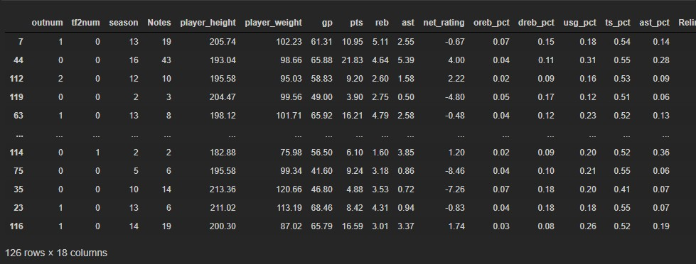
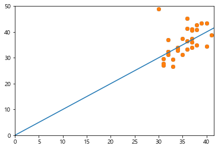

# NBA 선수 은퇴나이 추청 해보기_06

- 예측이라는 단어는 정확하게 맞추기 어렵다하여 추청으로 바꿔서 진행하려고 한다.

```python
model = keras.Sequential([
    layers.Dense(50, activation='relu', input_shape=[len(train_set.keys()) +1]),
    layers.Dense(50, activation='relu'),
    layers.Dense(1)
])

optimizer = tf.keras.optimizers.RMSprop()
model.compile(loss='mse', optimizer = optimizer, metrics=['mae', 'mse'])

model.summary()xxxxxxxxxx     layers.Dense(50, activation='relu', input_shape=[len(train_set.keys()) +1]),    layers.Dense(50, activation='relu'),    layers.Dense(1)])optimizer = tf.keras.optimizers.RMSprop()model.compile(loss='mse', optimizer = optimizer, metrics=['mae', 'mse'])model.summary()model = keras.Sequential([    layers.Dense(50, activation='relu', input_shape=[len(train_set.keys()) +1]),    layers.Dense(50, activation='relu'),    layers.Dense(1)])optimizer = tf.keras.optimizers.RMSprop()model.compile(loss='mse', optimizer = optimizer, metrics=['mae', 'mse'])model.summary()
```

- 계속 오류났던 부분이 `input_shape=[len(train_set.keys()) +1])` 여기였다.
- 보면 predict하려는 df의 열 개수는19개인데 input_shape가 18이여서 오류가 난것이다. 이걸 바꾸고 실행했다.

```python
sample_result = model.predict(norm_train_set[:10])
sample_result
>
array([[nan],
       [nan],
       [nan],
       [nan],
       [nan],
       [nan],
       [nan],
       [nan],
       [nan],
       [nan]], dtype=float32)
```

- 이번에는 아무 값도 나오지 않는 현상이 발생하였다. 이번에는 이걸 해결하자....

- 

```python
y_train = train_set.drop('age',axis=1)
y_test = test_set.drop('age',axis=1)
```

- 여기서 pop을 해버려서 원본 데이터에서 age가 빠져버렸다. 그래서 norm(x)를 했을 때 age가 없어서 NaN이 되었다.

```python
sample_result = model.predict(norm_train_set[:10])
sample_result
```

- 오류를 해결하면 예측 값을 얻을 수 있다.


```python
class PrintDot(keras.callbacks.Callback):
    def on_epoch_end(self, epoch, logs):
        if epoch % 100 == 0:print('')
        print(',', end='')
        
history = model.fit(norm_train_set, y_train, epochs=1000, validation_split=.2, verbose=0, callbacks=[PrintDot()])
```


- 이번에는 다른오류를 만났다.

- 에러에 대한 답이 잘 안나와서 더 찾아봐야겠다.

#### ERROR 해결

- was passed for an output of shape (none, 1) while using as loss `mean_squared_error`. this loss expects targets to have the same shape as the output.

- 다시 확인해보니 위에서부터 잘못 작성했던 것이다.

##### 변경 전 코드

```python
train_state = train_set.describe().T

y_train = train_set.drop('age', axis=1)
y_test = test_set.drop('age', axis=1)
```

#####  변경 후 코드

```python
train_state = train_set.describe()
train_state.pop('age')
train_state = train_state.T

y_train = train_set.pop('age')
y_test = test_set.pop('age')
```

- 우선 train_state부터 잘못작성하여 이 사태가 벌어졌다. 전에 배웠던 코드를 자세히 보니 저 부분이 달랐다.
- 우선 요약을 하고 거시서 종속변수를 제거하고 그 다음에 T를 해줘야 한다.
- drop도 pop로 바꿔서 하니 정상적으로 모델이 작동하였다.
  - train_set을 확인해보면 age가 빠져있다. drop를 해서 train_set에는 age가 남아있어서 그런 것  같다.

```
train_set
```



#### 다시 시작

```python
model = keras.Sequential([
    layers.Dense(50, activation='relu', input_shape=[len(train_set.keys())]),
    layers.Dense(50, activation='relu'),
    layers.Dense(1)
])

optimizer = tf.keras.optimizers.RMSprop()
model.compile(loss='mse', optimizer = optimizer, metrics=['mae', 'mse'])

model.summary()
>
Model: "sequential_2"
_________________________________________________________________
Layer (type)                 Output Shape              Param #   
=================================================================
dense_9 (Dense)              (None, 50)                950       
_________________________________________________________________
dense_10 (Dense)             (None, 50)                2550      
_________________________________________________________________
dense_11 (Dense)             (None, 1)                 51        
=================================================================
Total params: 3,551
Trainable params: 3,551
Non-trainable params: 0
_________________________________________________________________
```

```python
sample_result = model.predict(norm_train_set[:10])
sample_result
>
array([[ 0.09454657],
       [ 0.601721  ],
       [-0.17549348],
       [ 0.15665752],
       [ 0.1922263 ],
       [ 0.2839901 ],
       [-0.67191756],
       [ 0.87348086],
       [ 0.7287873 ],
       [-0.04939486]], dtype=float32)
```

```python
tf.keras.layers.Dense(1, activation='relu')
class PrintDot(keras.callbacks.Callback):
    def on_epoch_end(self, epoch, logs):
        if epoch % 100 == 0:print('')
        print(',', end='')
        
history = model.fit(norm_train_set, y_train, epochs=1000, validation_split=.2, verbose=0, callbacks=[PrintDot()])
>
,,,,,,,,,,,,,,,,,,,,,,,,,,,,,,,,,,,,,,,,,,,,,,,,,,,,,,,,,,,,,,,,,,,,,,,,,,,,,,,,,,,,,,,,,,,,,,,,,,,,
,,,,,,,,,,,,,,,,,,,,,,,,,,,,,,,,,,,,,,,,,,,,,,,,,,,,,,,,,,,,,,,,,,,,,,,,,,,,,,,,,,,,,,,,,,,,,,,,,,,,
,,,,,,,,,,,,,,,,,,,,,,,,,,,,,,,,,,,,,,,,,,,,,,,,,,,,,,,,,,,,,,,,,,,,,,,,,,,,,,,,,,,,,,,,,,,,,,,,,,,,
,,,,,,,,,,,,,,,,,,,,,,,,,,,,,,,,,,,,,,,,,,,,,,,,,,,,,,,,,,,,,,,,,,,,,,,,,,,,,,,,,,,,,,,,,,,,,,,,,,,,
,,,,,,,,,,,,,,,,,,,,,,,,,,,,,,,,,,,,,,,,,,,,,,,,,,,,,,,,,,,,,,,,,,,,,,,,,,,,,,,,,,,,,,,,,,,,,,,,,,,,
,,,,,,,,,,,,,,,,,,,,,,,,,,,,,,,,,,,,,,,,,,,,,,,,,,,,,,,,,,,,,,,,,,,,,,,,,,,,,,,,,,,,,,,,,,,,,,,,,,,,
,,,,,,,,,,,,,,,,,,,,,,,,,,,,,,,,,,,,,,,,,,,,,,,,,,,,,,,,,,,,,,,,,,,,,,,,,,,,,,,,,,,,,,,,,,,,,,,,,,,,
,,,,,,,,,,,,,,,,,,,,,,,,,,,,,,,,,,,,,,,,,,,,,,,,,,,,,,,,,,,,,,,,,,,,,,,,,,,,,,,,,,,,,,,,,,,,,,,,,,,,
,,,,,,,,,,,,,,,,,,,,,,,,,,,,,,,,,,,,,,,,,,,,,,,,,,,,,,,,,,,,,,,,,,,,,,,,,,,,,,,,,,,,,,,,,,,,,,,,,,,,
,,,,,,,,,,,,,,,,,,,,,,,,,,,,,,,,,,,,,,,,,,,,,,,,,,,,,,,,,,,,,,,,,,,,,,,,,,,,,,,,,,,,,,,,,,,,,,,,,,,,
```

- 모델이 작동하고 있다는 표시이다.

```python
loss, mae, mse = model.evaluate(norm_test_set, y_test,verbose=1)
print('평균 절대 오차 : ',mae)
>
31/31 [==============================] - 0s 130us/sample - loss: 24.5069 - mae: 3.4981 - mse: 24.5069
평균 절대 오차 :  3.4980714
```

```python
import matplotlib.pyplot as plt
# 시각화
y_pred = model.predict(norm_test_set).flatten()
plt.scatter(y_test, y_pred)
plt.xlim([0,plt.xlim()[1]])
plt.ylim([0,plt.ylim()[1]])
plt.scatter(y_test, y_pred)
_ = plt.plot([-100,100],[-100,100])
plt.show()
```



- 선을 따라서 모여있는게 좋은건데 잘 추정이 된 것일까?
- tensorflow의 결과값을 해석하는 시간을 갖자.