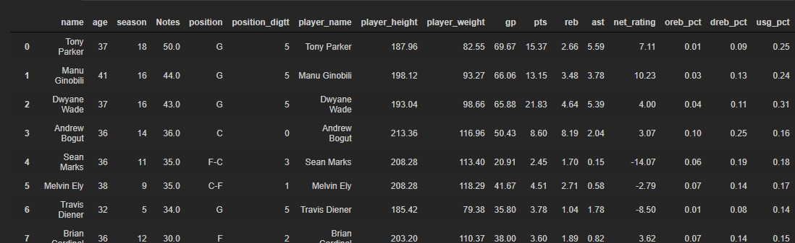

# NBA 선수 은퇴나이 예측해보기_03

### 포지션 크롤링

- nba-api에서 포지션을 뽑아오려고 했는데 아무리 찾아봐도 안 보여서 그냥 홈페이지에서 크롤링하기로 하였다.

```python
position_name = list(nba_injury_merge['name'])
position_name
```

- 우선 선수이름을 리스트로 만든다.

```python
position_dic = {}
for name in position_name:
    position_dic[name] = 0
position_dic
```

- 그 다음에 딕셔너리로 만들어서 관리한다.

```python
driver.get('https://www.nba.com/players')
page = driver.find_elements_by_css_selector('.Toggle_slider__hCMQQ')[0].click()
key_words = driver.find_elements_by_css_selector('.Input_input__3YQfM')[0]
for names in list(position_dic.keys()):
    try:
        key_words.send_keys(names)
        time.sleep(1)
        position_table = driver.find_elements_by_css_selector('.players-list')[0]
        position_tr = position_table.find_elements_by_tag_name('tr')[1]
        position_td = position_tr.find_elements_by_tag_name('td')[3].text
        position_dic[names] = position_td
        print(position_td)
        key_words.clear()
        time.sleep(1)
    except:
        position_dic[names] = 0
```

- 중간에 오류가 나서 try랑 except로 관리하였다.


- 모든 선수들을 보려면 저 버튼을 클릭해야 한다.

`page = driver.find_elements_by_css_selector('.Toggle_slider__hCMQQ')[0].click()` 그래서 찾아서 클릭한다.


- 그 다음에 저기에 선수이름을 입력하면 선수의 목록이 뜬다.

```python
# 인풋태그 찾기
key_words = driver.find_elements_by_css_selector('.Input_input__3YQfM')[0]
# 선수이름을 for문으로 돌려서 입력하기
for names in list(position_dic.keys()):
    try:
        #선수 이름을 input에 입력해서 보내기
        key_words.send_keys(names)
        time.sleep(1)
```


- 그런다음 포지션이 있는 태그를 찾아서 text만 받아서 딕셔너리를 업데이트 시킨다.

```python
		position_tr = position_table.find_elements_by_tag_name('tr')[1]
    	# 포지션 인덱스 찾기
        position_td = position_tr.find_elements_by_tag_name('td')[3].text
        # 딕셔너리 업데이트
        position_dic[names] = position_td
        print(position_td)
        # 다음 선수입력을 위해 원래있던 이름 지우기
        key_words.clear()
        time.sleep(1)
    except:
        position_dic[names] = 0
```


- 작동시키면 이렇게 진행된다.

```python
for key, value in position_dic.items():
    if value == 0:
        print(key)
```

- 마지막으로 입력안된 선수가 있는지 최종확인한다.

#### df와 합치기

```python
nba_injury_merge['position'] = nba_injury_merge['name'].apply(lambda x:posi(x,position_dic))
nba_injury_merge
```


- 이렇게 업데이트 되었다. csv로 저장하자.

```python
nba_injury_merge.to_csv('nba_injury_merge_position.csv',mode='w',index=False)
```

### 포지션 라벨링

#### 필요한 패키지 import

```python
from sklearn.datasets import load_iris, load_breast_cancer
from sklearn.tree     import DecisionTreeClassifier
from sklearn.model_selection import  GridSearchCV,train_test_split
from sklearn.metrics import accuracy_score

from sklearn.preprocessing import LabelEncoder
from sklearn.preprocessing import OneHotEncoder
```

```python
item_label  = list(injury_df.groupby('position').agg({'position':'count'}).index)

encoder = LabelEncoder()
encoder.fit(item_label)

digit_label = encoder.transform(item_label)
print('encoder 결과', digit_label)

print('decoder 결과', encoder.inverse_transform(digit_label))

digit_label = digit_label.reshape(-1,1)
print(digit_label)
print(digit_label.shape)
>
encoder 결과 [0 1 2 3 4 5 6]
decoder 결과 ['C' 'C-F' 'F' 'F-C' 'F-G' 'G' 'G-F']
[[0]
 [1]
 [2]
 [3]
 [4]
 [5]
 [6]]
(7, 1)
```

- 이렇게 하면 포지션 영어 순서대로 숫자 라벨링이 적용된다.

```python
ont_hot_encoder = OneHotEncoder()
ont_hot_encoder.fit(digit_label)
ont_hot_label = ont_hot_encoder.transform(digit_label)
print(ont_hot_label.toarray())
print(ont_hot_label.shape)
>
[[1. 0. 0. 0. 0. 0. 0.]
 [0. 1. 0. 0. 0. 0. 0.]
 [0. 0. 1. 0. 0. 0. 0.]
 [0. 0. 0. 1. 0. 0. 0.]
 [0. 0. 0. 0. 1. 0. 0.]
 [0. 0. 0. 0. 0. 1. 0.]
 [0. 0. 0. 0. 0. 0. 1.]]
(7, 7)
```

- 이렇게 하면 행렬로 채워진다.

```python
pd.get_dummies(injury_df)
```


- 선수별로 해당되는 곳만 1이 채워진다. 

### 포지션 추가해서 상관관계 보기

```python
def posi_digt(x,item_label,digit_label):
    for idx, value in enumerate(item_label):
        if x == value:
            return digit_label[idx][0]
```

```python
injury_df['position_digtt'] = injury_df['position'].apply(lambda x:posi_digt(x,item_label,digit_label))
injury_df.head()
```

- 새로운 컬럼으로 추가한다.


```python
def corr(data,text):
    corr = data.corr(method='pearson')
    display(corr)
    style.use('ggplot')
    plt.title(text)
    sns.heatmap(data = corr, annot=True, fmt = '.2f', linewidths=.5, cmap='Blues')
```

```python
corr(injury_df,'상관관계')
```


- 거의 상관없다고 나온다. 다음에는 파라미터를 수정해서 머신러닝을 돌려보자.

### 변수 추가하기

```python
nba_all = pd.read_csv('all_seasons.csv').drop('Unnamed: 0',axis=1)
nba_all.head()
```

- 기존에 있던 정보들이랑 합쳐보자.

```python
import math
# 평균을 구하고 모두 소수 2번째까지만 살리기
nba_all_group = nba_all.groupby('player_name',as_index=False).mean()
for i in range(nba_all_group.shape[0]):
    for i2 in range(len(list(nba_all_group.columns))):
        if i2 == 0:
            continue
        elif i2 == 1:
            nba_all_group.iloc[i,i2] =  nba_all_group.iloc[i,i2].astype('int64')
        else:
            nba_all_group.iloc[i,i2] = round(nba_all_group.iloc[i,i2],2)
```

- 선수들의 기록을 평균으로 만들어서 합치기로 하였다.

```python
nba_all_group['age'] = nba_all_group['age'].astype('int64')
nba_all_group
```


```python
df_merge = pd.merge(injury_df,nba_all_group,left_on='name',right_on='player_name',how='left').drop('age_y',axis=1).rename(columns={'age_x':'age'})
df_merge
```

- merge한 후 필요없는 컬럼과 컬럼명을 정리하였다.



#### 다시 상관관계 돌려보기

```python
corr(df_merge,'상관관계')
```


- 은퇴나이랑 가장 연관이 높은건 시즌횟수로 0.72로 대폭 상승하였다. 그 다음에 높은건 gp, net_rating 등이 있다.

### DecisionTreeClassifier하기

#### 필요한 패키지 import

```python
from sklearn.tree     import DecisionTreeClassifier
from sklearn.model_selection import cross_val_score, cross_validate
```

#### 검증해보기

```python
cvs_dtc = DecisionTreeClassifier(random_state = 200)
feature = df_merge.drop(['age','name','position','player_name'],axis=1)
label = df_merge[['age']]

display(feature.head())
display(label.head())

scoring = cross_val_score(cvs_dtc, feature,label,scoring='accuracy',cv=5 )
print('교차 검증별 정확도 :',scoring)
print('평균 검증 정확도 :',np.mean(scoring))
```


- 0.16로 아주 낮은 정확도를 보여준다....ㅠㅠ 처음 생각과는 많이 달라지는 결과다.

#### cv=10

```python
scoring = cross_val_score(cvs_dtc, feature,label,scoring='accuracy',cv=10)
print('교차 검증별 정확도 :',scoring)
print('평균 검증 정확도 :',np.mean(scoring))

>
교차 검증별 정확도 : [0.22222222 0.22222222 0.22222222 0.23529412 0.11764706 0.11764706
 0.11764706 0.23529412 0.17647059 0.05882353]
평균 검증 정확도 : 0.17254901960784313
```

- 폴더 개수를 늘렸더니 검증도가 살짝 올랐다.

```python
from sklearn.metrics import accuracy_score
```

```python
X_train, X_test , y_train, y_test = train_test_split(feature, 
                                                     label,
                                                     test_size=0.2,
                                                    random_state=200)
```

- 데이터를 나눈다.

#### 파라미터 수정하기

```python
gscv_tree = DecisionTreeClassifier()
params = {'criterion' : ['gini', 'entropy'], 
          'splitter' : ['random','best'], 
          'max_depth' : [1,2,3], 
          'min_samples_split' : [2,3]}

grid_gscv_tree = GridSearchCV(gscv_tree, param_grid = params,cv=10,refit=True )

grid_gscv_tree.fit(X_train, y_train)
grid_gscv_tree.cv_results_
score_df = pd.DataFrame(grid_gscv_tree.cv_results_)
display(score_df[['params', 'mean_test_score', 'rank_test_score','split0_test_score','split1_test_score','split2_test_score']].head(10))

print('최적의 파라미터 : ', grid_gscv_tree.best_params_)
print('높은 정확도 : ', grid_gscv_tree.best_score_)

estimator = grid_gscv_tree.best_estimator_
prediction = estimator.predict(X_test)

print('테스트 세트의 정확도 : ', accuracy_score(y_test,prediction))
y_test['prediction'] = prediction
display(y_test)
```


- 확실히 파라미터를 수정하니 처음보다 약 9%가 상승하였다.

### 데이터 정규화, 표준화 하기

- 데이터의 범위가 각자 다르기 때문에 스케일링 실시

#### 함수 만들기

```python
### 데이터 정규화와 표준화하기
def feture_scaling(df, scaling_strategy, column=None):
    if column == None:
        column = [column_name for column_name in df.columns]
    for column_name in column:
        if scaling_strategy == "min-max":
            df[column_name] = ( df[column_name] - df[column_name].min() ) /\
                            (df[column_name].max() - df[column_name].min()) 
        elif scaling_strategy == "z-score":
            df[column_name] = ( df[column_name] - \
                               df[column_name].mean() ) /\
                            (df[column_name].std() )
    return df
```

````python
#정규화
n_df = feture_scaling(df_merge,'min_max',column=['age','season','Notes','position_digtt','player_height','player_weight','gp',
                                                'pts','reb','ast','net_rating','oreb_pct','dreb_pct','usg_pct','ts_pct','ast_pct'])
#표준화
f_df = feture_scaling(df_merge,'z-score',column=['age','season','Notes','position_digtt','player_height','player_weight','gp',
                                                'pts','reb','ast','net_rating','oreb_pct','dreb_pct','usg_pct','ts_pct','ast_pct'])

display(n_df.head())
display(f_df.head())
````


### sklearn에 있는 함수로 이용하기

```python
from sklearn.preprocessing import  StandardScaler, MinMaxScaler
```

#### 표준화

```python
std_scaler  = StandardScaler()

df_std = std_scaler.fit(df_merge[['age','season','Notes','position_digtt','player_height','player_weight','gp',
                             'pts','reb','ast','net_rating','oreb_pct','dreb_pct','usg_pct','ts_pct','ast_pct']])\
                        .transform(df_merge[['age','season','Notes','position_digtt','player_height','player_weight','gp',
                             'pts','reb','ast','net_rating','oreb_pct','dreb_pct','usg_pct','ts_pct','ast_pct']])
df_std[:5]
```


#### 정규화

```python
minmax_scaler  = MinMaxScaler()

df_minmax  = minmax_scaler.fit(df_merge[['age','season','Notes','position_digtt','player_height','player_weight','gp',
                             'pts','reb','ast','net_rating','oreb_pct','dreb_pct','usg_pct','ts_pct','ast_pct']])\
                        .transform(df_merge[['age','season','Notes','position_digtt','player_height','player_weight','gp',
                             'pts','reb','ast','net_rating','oreb_pct','dreb_pct','usg_pct','ts_pct','ast_pct']])
df_minmax [:5]
```


##### 테스트 데이터는 스케일링을 실시해도 트레인 데이터는 하면 안 된다. 트레인 데이터만 다시 스케일링한다.

### 선수 이름 라벨링

```python
item_label  = list(df_merge.groupby('name').agg({'name':'count'}).index)

encoder = LabelEncoder()
encoder.fit(item_label)

name_label = encoder.transform(item_label)

name_label = name_label.reshape(-1,1)

def name_digt(x,item_label,digit_label):
    for idx, value in enumerate(item_label):
        if x == value:
            return digit_label[idx][0]
        
df_merge['name_digtt'] = df_merge['name'].apply(lambda x:name_digt(x,item_label,name_label))
df_merge.head()

df_merge_name_none = df_merge.drop(['name','position'],axis=1)
```

- 우선 선수이름을 라벨링해서 숫자로 바꾼다.

```python
train_array=df_merge_name_none.loc[0:100,:]
test_array=df_merge_name_none.loc[101:,:]
```

##### 테스트 데이터는 스케일링을 실시해도 트레인 데이터는 하면 안 된다. 트레인 데이터만 다시 스케일링한다.

```python
from sklearn.preprocessing import  StandardScaler, MinMaxScaler
scaler = MinMaxScaler()
train_scaler = scaler.fit(train_array).transform(train_array)

test_scaler = scaler.transform(test_array)
```

```python
train_scaler

>
array([[0.6       , 0.8       , 1.        , ..., 0.75      , 0.82352941,
        0.92307692],
       [0.86666667, 0.7       , 0.85      , ..., 0.91666667, 0.61764706,
        0.5739645 ],
       [0.6       , 0.7       , 0.825     , ..., 0.79166667, 0.73529412,
        0.26627219],
       ...,
       [0.6       , 0.3       , 0.        , ..., 0.70833333, 0.17647059,
        0.20118343],
       [0.6       , 0.7       , 0.        , ..., 0.75      , 0.17647059,
        0.84615385],
       [0.4       , 0.55      , 0.        , ..., 0.875     , 0.14705882,
        0.69230769]])
```

```python
test_scaler

>
array([[ 0.53333333,  0.3       ,  0.        , ...,  0.20833333,
         0.02941176,  0.27218935],
       [ 0.2       ,  0.1       ,  0.        , ...,  0.41666667,
         0.64705882,  0.68047337],
       [ 0.4       ,  0.5       ,  0.        , ...,  0.66666667,
         0.23529412,  0.63313609],
       ...,
       [ 0.73333333,  0.1       , -0.225     , ...,  0.875     ,
         0.64705882,  0.67455621],
       [ 0.66666667,  0.1       , -0.225     , ...,  0.45833333,
         0.32352941,  0.42011834],
       [ 0.33333333, -0.05      , -0.225     , ...,  0.29166667,
         0.08823529,  0.94674556]])
```

- 그러면 범위가 같아진다. testdata를 같이 fit하면 범위가 달라진다.


