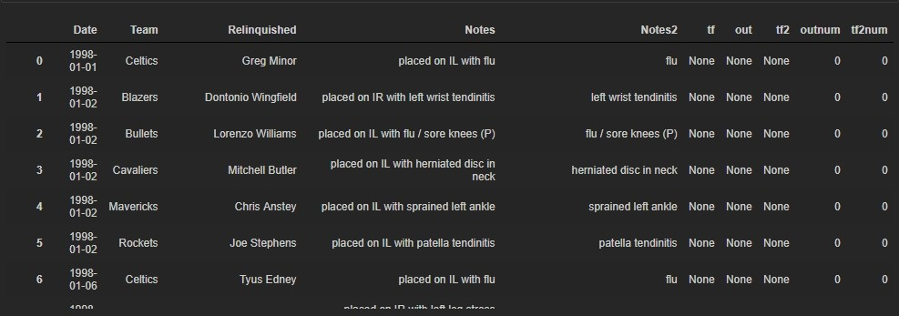
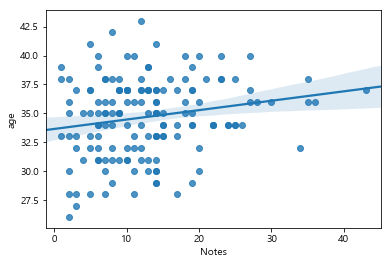

# NBA 선수 은퇴나이 예측해보기_04

- 지금까지 했던건 이진분류가 계속 정확도가 낮은 것으로 예측하기보다 우선 변수를 추가하기로 했다.
- 십자인대, 아킬레스 부상이 대표적으로 선수들의 은퇴를 앞당기는 부상이다. 그래서 십자인대,  아킬레스로 컬럼을 만들어 해당 부상을 당했으면 1, 아니면 0으로 부여하려고 한다.
  - 십자인대 부상 종류 
  - 출처 : ROOKIE(http://www.rookie.co.kr)
    - ACL Injury 전방십자인대 부상 
    - PCL Injury 후방십자인대 부상
    - MCL Injury 내측측부인대 부상
    - LCL Injury 외측측부인대 부상
- 부상내역중에 4개의 단어가 들어가면 십자인대로 아킬레스는 Achilles Tendon Rupture가 들어가면 카운트하기로 결정하였다.
- 그리고 out for season도 따로 컬럼으로 만들어서 넣기로 하였다. 그만큼 운동능력에 영향을 주는 부상이라고 판단하였다.

### 필요한 패키지 import 

```python
import pandas as pd
import numpy as np
import matplotlib as mpl
import matplotlib.pyplot as plt
import matplotlib.pylab as plt
import datetime 
%matplotlib inline
import matplotlib
matplotlib.rcParams['axes.unicode_minus'] = False

import matplotlib.pyplot as plt
%matplotlib inline

import platform
import seaborn as sns

import warnings
warnings.filterwarnings('ignore')

from matplotlib import font_manager, rc
from matplotlib import style

if platform.system() == 'Darwin':
    rc('font', family='AppleGothic')
elif platform.system() == 'Windows':
    path = "c:/Windows/Fonts/malgun.ttf"
    font_name = font_manager.FontProperties(fname=path).get_name()
    rc('font', family=font_name)
else:
    print('Unknown system... sorry~~~~') 
```

### 십자인대, 아켈레스 부상 여부

```python
df = pd.read_csv('nba_injury_1998.csv')

def yesno(x):
    words = x.split(' ')
    print(words)
    for word in words:
        if word.upper() in ['ACL', 'PCL', 'ACHILLES']:
            return True
            break   
df['tf'] = df['Notes2'].apply(lambda x:yesno(x))
```


- 이렇게 분리해서 for문을 돌리면서 ['ACL', 'PCL', 'ACHILLES']가 있는지 확인하고 있으면 True를 리턴하고 나온다. 편리하게 모두 대문자로 바꿔서 비교하였다.

### 시즌아웃 부상 여부

```python
import re

# 시즌아웃 부상
def seasonout(x):
    words = re.split('\(|\)', x)
    print(words)
    for word in words:
        if word in ['out for season']:
            return True
            break
    
df['out']  = df['Notes2'].apply(lambda x:seasonout(x))
```


- 이렇게 out for season가 있으면 또한 Ture를 리턴하고 나온다.

```python
display(df[(df['out'] == True) | (df['tf'] == True)])
df[(df['out'] == True) | (df['tf'] == True)].shape
>
(796, 7)
```

- 총 796명의 선수가 나왔다.


- 이렇게 둘다 True인 선수도 있고 아닌 선수도 있다. 저기서 파열인 경우만 분리하자.
- 아킬레스건염이나 염좌는 tendinitis과 strain으로 표시하고 파열과 완파는 torn과 rupture로 표시한다. 그래서 torn과 rupture이 들어있는 선수들은 1로 준다.

```python
def yesno2(x):
    words = x.split(' ')
    print(words)
    sum_sum = 0
    for word in words:
        if word.upper() in ['ACL', 'PCL', 'ACHILLES'] or word.upper() in['TORN','RUPTURE']:
            sum_sum += 1
        if sum_sum >= 2:
            return True
            break   
df['tf2'] = df['Notes2'].apply(lambda x:yesno2(x))
```

- 우선 해당되는 선수들에 True을 주었다.


```python
def oneOrzero(x):
    two=0
    three=0
    if x['out'] == True:
        two = 1
    if  x['tf2'] == True:
        three = 1
    print(two, three)    
    return  pd.Series([two,three])
df[['outnum','tf2num']] = df[['out','tf2']].apply(oneOrzero,axis=1)
df
```



- 이렇게 해서 해당되는 선수들에게 1의 값을 부여하였다. 이 값을 이제 sum해서 완성하자.

```python
df_sum = df.groupby('Relinquished',as_index=False).agg({'outnum':'sum','tf2num':'sum'})
display(df_sum)
```


- 이렇게 sum을하여 몇번 부상당했는지 가중치처럼 적용되었다. LinearRegression로 회귀분석을 해보자.

### 다른 데이터들과 합치기

```python
injury_df = pd.read_csv('nba_injury_merge_position.csv')
injury_df.head()

df_merge1 = pd.merge(df_sum,injury_df,left_on='Relinquished',right_on='name').drop('name',axis=1)
df_merge1.head()

nba_all = pd.read_csv('all_seasons.csv').drop('Unnamed: 0',axis=1)
nba_all.head()
```

```python
import math
# 평균을 구하고 모두 소수 2번쨰까지만 살리기
nba_all_group = nba_all.groupby('player_name',as_index=False).mean()
for i in range(nba_all_group.shape[0]):
    for i2 in range(len(list(nba_all_group.columns))):
        if i2 == 0:
            continue
        elif i2 == 1:
            nba_all_group.iloc[i,i2] =  nba_all_group.iloc[i,i2].astype('int64')
        else:
            nba_all_group.iloc[i,i2] = round(nba_all_group.iloc[i,i2],2)

nba_all_group['age'] = nba_all_group['age'].astype('int64')
nba_all_group.head()
```

```python
df_merge = pd.merge(df_merge1,nba_all_group,left_on='Relinquished',right_on='player_name',how='left').\
drop('age_y',axis=1).rename(columns={'age_x':'age'})

df_merge.drop('player_name',axis=1,inplace=True)

df_merge['Notes'] = df_merge['Notes'].astype(int)
df_merge.head()
```


- 기존에 있던 정보들을 최종적으로 만든 정보들과 합친다.

### 다중회귀 분석 하기

```python
from sklearn.linear_model import LinearRegression

lr_model = LinearRegression()

print(df_merge.shape)
df_merge.plot(kind='scatter',x='Notes',y='age',c='red',s=10)
plt.show()

>
(157, 19)
```


- 선형관계 확인을  위해서 산점도를 그렸는데 전혀 선형 관계가 보이지 얺는다.

```python
sns.regplot(x='Notes',y='age',data=df_merge)
plt.show()
```



- 선이랑 같이 그렸는데 관계가 있는건지 전혀 모르겠다.

```python
sns.pairplot(df_merge)
plt.show()
```


- 모든 변수들의 선형관계를 확인해서 독립변수를 선택한다. 그냥 다 해보기로 했다.