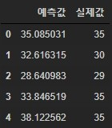
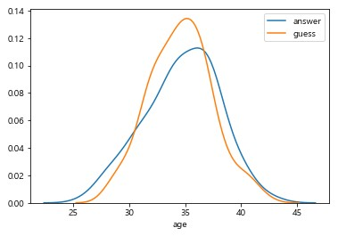
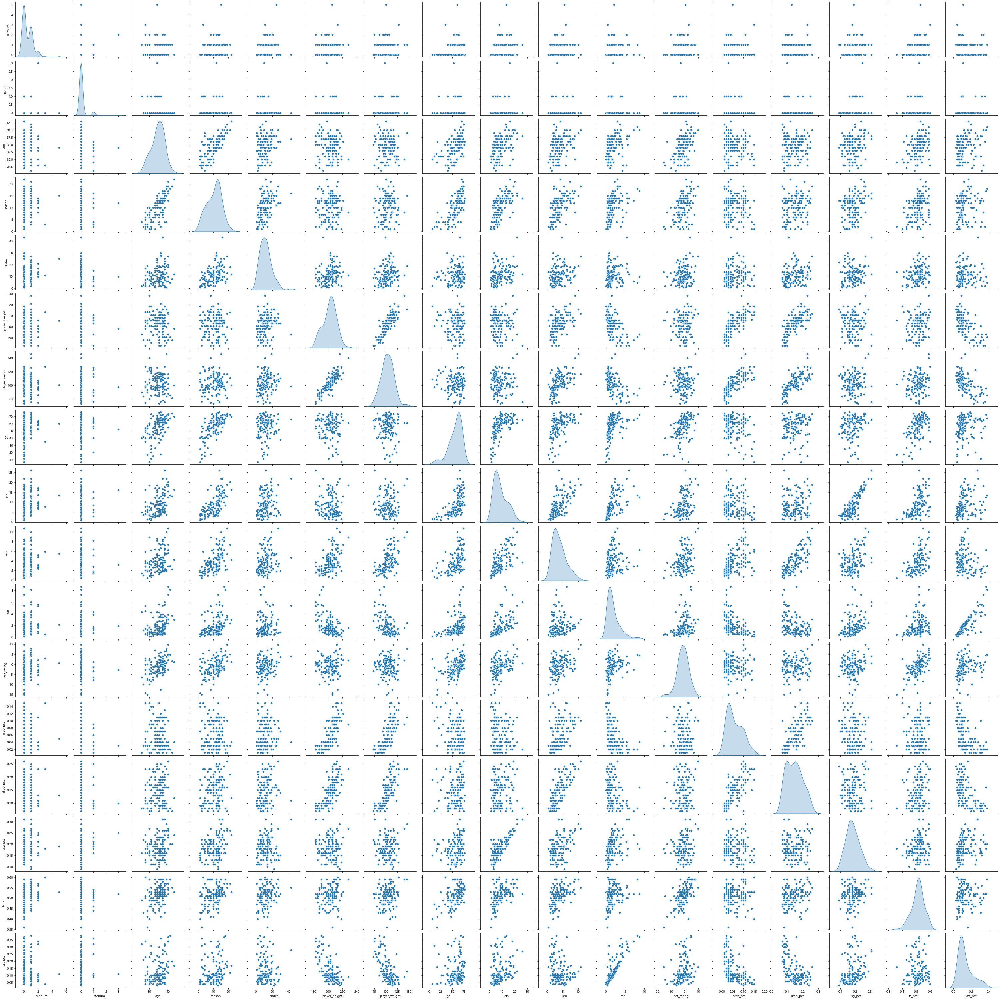
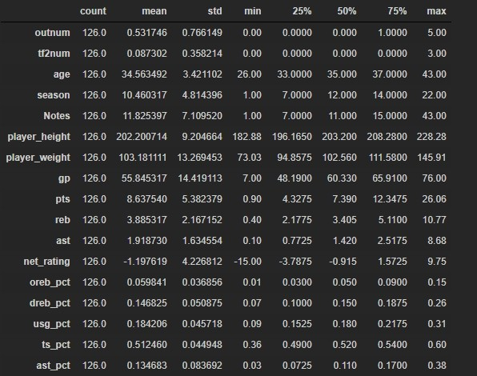
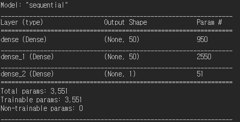
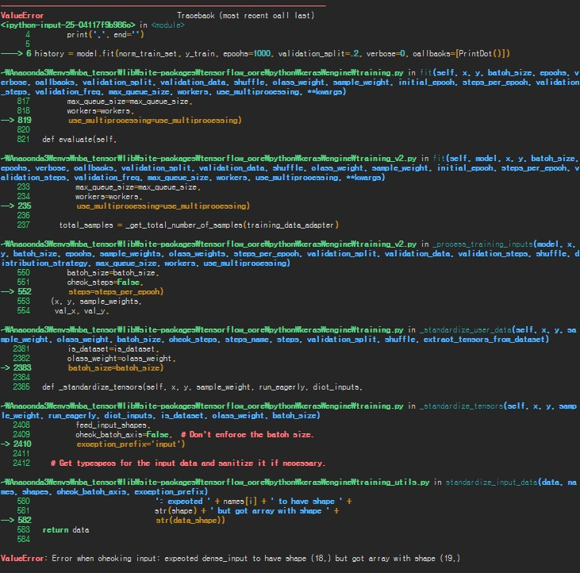
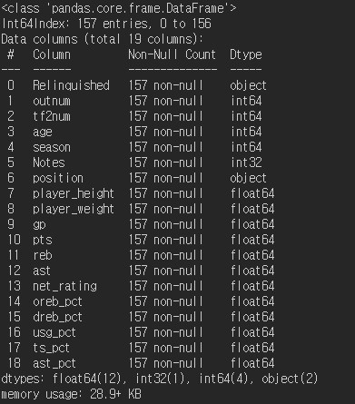
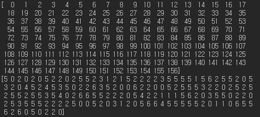
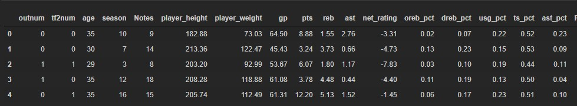
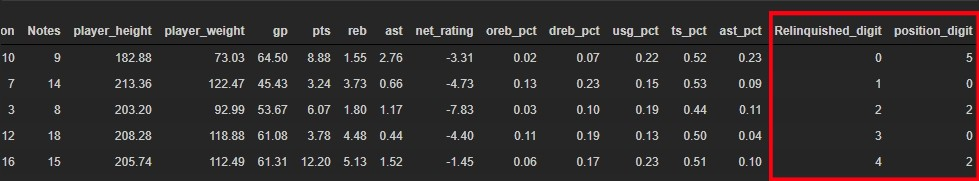

# NBA 선수 은퇴나이 예측해보기_05

### 포지션 인코딩 하기

```python
from sklearn.preprocessing import LabelEncoder

encoder = LabelEncoder()
encoder.fit(df_merge['position'])
digit = encoder.transform(df_merge['position'])
df_merge['position_label'] = digit
```

- 포지션이 영어라서 회귀분석 시 인식이 안되기 때문에 인코딩하여 숫자로 바꾼 후 새로운 컬럼으로 넣어준다.

### 다중회귀분석 

```python
X = df_merge.drop(['age','Relinquished','position'],axis=1)
y = df_merge['age']
```

- X,y 데이터를 나눈다. X는 독립변수고 y는 종속변수다.

```python
from sklearn.model_selection import train_test_split
X_train, X_test, y_train, y_test = train_test_split(X,y,test_size = 0.2,random_state=10)
```

- 트레인과 테스트로 데이터셋을 나눈다.

```python
lr_model.fit(X_train, y_train)

r_square = lr_model.score(X_test, y_r_square = lr_model.score(X_test, y_test)
print(f'결정계수 : {r_square}')
>
결정계수 : -0.011366196674897688
```

- 학습 한 후 결정계수를 보았는데 처참하다.

```python
print('기울기 : ', lr_model.coef_)
print('졀편 : ', lr_model.intercept_)
>
기울기 :  [[-6.32465742e-01 -1.75111611e-01  7.23861580e-01 -5.22521510e-02
   2.00270416e-02 -4.21996213e-02 -6.02528846e-02 -2.84698905e-01
  -3.07364264e-02  3.23139412e-01  1.32611533e-01 -8.96505609e+00
   1.27419389e+00  2.49837777e+01  1.47583025e+01 -7.27557627e+00
  -1.96844510e-01]]
졀편 :  [23.32210023]
```

```python
y_pred = lr_model.predict(X)

data_pre = pd.DataFrame({
        '예측값' : np.ravel(y_pred),
        '실제값' : y
})
data_pre.head()
```

- 예측값과 실제값을 비교해보자.



- 생각보다는 잘 맞는것 같은데 다른 방법으로 더 자세하게 해보자.

```python
sns.distplot(y, hist=False, label='answer')
sns.distplot(y_pred, hist=False, label='guess')
plt.show()
```



- predict로 하면 차이가 얼마 안 난다.
- tensorflow를 사용해보자.

### 가상환경 하나 만들기

```
conda create --name 이름 python=3.x
```

- 가상환경을 만든다.

```
conda activate 이름
```

- 가상환경을 실행한다.

```
conda install jupyter notebook
conda install tensorflow
conda install pandas
conda install numpy
conda install seaborn
```

- 필요한 패키지들을 설치한다.

# Tensorflow Regression

```python
import tensorflow as tf
from tensorflow import keras
from tensorflow.keras import layers

import pandas as pd
import numpy as np
import seaborn as sns

print(tf.__version__)
>
2.1.0
```

```python
df_merge.isna().sum()
>
Relinquished     0
outnum           0
tf2num           0
age              0
season           0
Notes            0
position         0
player_height    0
player_weight    0
gp               0
pts              0
reb              0
ast              0
net_rating       0
oreb_pct         0
dreb_pct         0
usg_pct          0
ts_pct           0
ast_pct          0
dtype: int64
```

- 결측치 확인 후 진행

```python
train_set = df_merge.sample(frac=.8, random_state=0)
test_set = df_merge.drop(train_set.index)
```

```python
sns.pairplot(train_set[['Relinquished', 'outnum', 'tf2num', 'age', 'season', 'Notes',
       'position', 'player_height', 'player_weight', 'gp', 'pts', 'reb', 'ast',
       'net_rating', 'oreb_pct', 'dreb_pct', 'usg_pct', 'ts_pct', 'ast_pct']], diag_kind='kde')
```



````python
train_state = train_set.describe().T
train_state
````



- train의 요약 정보를 담는다.

```python
y_train = train_set.pop('age')
y_test = test_set.pop('age')
```

- 종속 변수만 따로 담는다.

```python
def norm(x):
    return (x - train_state['mean']) / train_state['std']

norm_train_set = norm(train_set)
norm_test_set = norm(test_set)
```

- 정규화 실시

```python
model = keras.Sequential([
    layers.Dense(50, activation='relu', input_shape=[len(train_set.keys())]),
    layers.Dense(50, activation='relu'),
    layers.Dense(1)
])
```

- 모델을 만든다.

```python
optimizer = tf.keras.optimizers.RMSprop()
model.compile(loss='mse', optimizer = optimizer, metrics=['mae', 'mse'])
```

- optimizer : 학습을 통해 최적화된 결정계수를 찾아준다.

```python
model.summary()
```



#### class 생성 후 모델 학습

```python
class PrintDot(keras.callbacks.Callback):
    def on_epoch_end(self, epoch, logs):
        if epoch % 100 == 0:print('')
        print(',', end='')
        
history = model.fit(norm_train_set, y_train, epochs=1000, validation_split=.2, verbose=0, callbacks=[PrintDot()])
```



- 다음과 같은 오류가 발생하여 해결하고 넘어가자.

### 문자로 된 행들 라벨링

```python
from sklearn.preprocessing import LabelEncoder
```

#### object인 컬럼만 찾기

```python
df_merge.info()
```



- 여기서 object인 타입들만 숫자로 바꿔준다.

```python
encoder = LabelEncoder()
encoder.fit(list(df_merge['Relinquished']))
digit_label_Relinquished = encoder.transform(df_merge['Relinquished'])
print(digit_label_Relinquished)

encoder.fit(list(df_merge['position']))
digit_label_position = encoder.transform(df_merge['position'])
print(digit_label_position)
```



- 다음과 같이 라벨링을 해준다. 함수로 만들어서 하려다가 그냥 2개만 적용하면 돼서 풀어서 적용하였다.

#### 새로운 컬럼으로 넣어주기

```python
df_merge['Relinquished_digit'] = digit_label_Relinquished
df_merge['position_digit'] = digit_label_position
df_merge_renew  = df_merge.drop(['Relinquished','position'],axis=1)

df_merge_renew.head()
```





- 기존에 있던 df에서 문자열을 제거하고 라벨링 된 값을 새로운 컬럼으로 넣었다. 이 데이터로 다시 tenforflow를 시작하자.

- 인코딩을 변환하고 다음과 같은 코드를 실행하니 위에서 같은 오류가 발생하여 원인을 찾기로 하였다.

```python
sample_result = model.predict(norm_train_set[:10])
sample_result
```

#### 수정하기

```python
train_set = df_merge_renew.sample(frac=.8, random_state=0)
test_set = df_merge_renew.drop(train_set.index)
```

- 우선 위에서 새롭게 만든 df가 아니라 기존 df_merge를 사용해서 다시 바꿔주었다. 그리고 

```python
ary = np.array(norm_train_set)

sample_result = model.predict(norm_train_set[:10])
sample_result
```

- 검색해보니 array로 바꿔서 진행하라는 말이 있어서 해봤는데 같은 오류가 발생하여 더 찾아봐야겠다.
