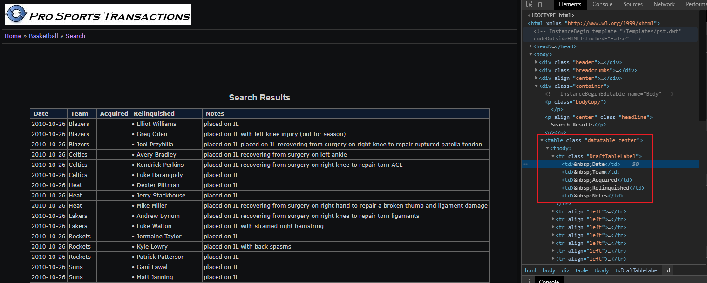

# nba 선수 부상내역 크롤링 후 csv로 저장하기

> 워낙 데이터가 많아서 한 번 실행하면 2시간 정도 소요된다.

### 전체 소스코드

```python
import pandas as pd

from selenium import webdriver
from selenium.webdriver.chrome.service import Service as ChromeService
from selenium.webdriver.common.by import By

options = webdriver.ChromeOptions()
service = ChromeService(executable_path='./chromedriver.exe')
driver = webdriver.Chrome(service=service, options=options)


def craw(start, end):
    page_list = [i for i in range(start, end, 25)]
    Date = []
    Team = []
    Acquired = []
    Relinquished = []
    Notes = []
    for page in page_list:
        driver.get(
            'http://www.prosportstransactions.com/basketball/Search/SearchResults.php?Player=&Team=&BeginDate=1998-01-01&EndDate=2020-12-31&ILChkBx=yes&Submit=Search&start=' + str(
                page))
        page = driver.find_elements(By.CSS_SELECTOR, '.datatable')
        if len(page) != 0:
            for i in page[0].find_elements(By.TAG_NAME, 'tbody'):
                k = i.find_elements(By.TAG_NAME, 'tr')
                for data in k:
                    ll = data.find_elements(By.TAG_NAME, 'td')
                    Date.append(ll[0].text)
                    Team.append(ll[1].text)
                    Acquired.append(ll[2].text)
                    Relinquished.append(ll[3].text)
                    Notes.append(ll[4].text)
    return Date, Team, Acquired, Relinquished, Notes


Date, Team, Acquired, Relinquished, Notes = craw(0, 5001)
Date1, Team1, Acquired1, Relinquished1, Notes1 = craw(5001, 10001)
Date2, Team2, Acquired2, Relinquished2, Notes2 = craw(10001, 15001)
Date3, Team3, Acquired3, Relinquished3, Notes3 = craw(15000, 20001)
Date4, Team4, Acquired4, Relinquished4, Notes4 = craw(20001, 25001)
Date5, Team5, Acquired5, Relinquished5, Notes5 = craw(25001, 28526)

data_collection = [[Date, Team, Acquired, Relinquished, Notes],
                   [Date1, Team1, Acquired1, Relinquished1, Notes1],
                   [Date2, Team2, Acquired2, Relinquished2, Notes2],
                   [Date3, Team3, Acquired3, Relinquished3, Notes3],
                   [Date4, Team4, Acquired4, Relinquished4, Notes4],
                   [Date5, Team5, Acquired5, Relinquished5, Notes5]]


def create_dataframe(date, team, acquired, relinquished, notes):
    df = pd.DataFrame({
        'Date': date,
        'Team': team,
        'Acquired': acquired,
        'Relinquished': relinquished,
        'Notes': notes
    })
    return df


data_df = {}

for idx, datas in enumerate(data_collection):
    date, team, acquired, relinquished, notes = datas
    data_df[f"df{idx}"] = create_dataframe(Date, Team, Acquired, Relinquished, Notes)

nba_injury_1998 = pd.concat([*data_df.values()])
drop_index = list(nba_injury_1998[nba_injury_1998['Date'] == ' Date'].index)
nba_injury_1998 = nba_injury_1998.drop(drop_index).reset_index(drop=True)
none_Relinquished = list(nba_injury_1998[nba_injury_1998['Relinquished'] == ''].index)
nba_injury_1998 = nba_injury_1998.drop(none_Relinquished).reset_index(drop=True)
nba_injury_1998 = nba_injury_1998.drop(['Acquired'], axis=1)
nba_injury_1998.to_csv('nba_injury_1998.csv', mode='w', index=False)

for i in range(nba_injury_1998.shape[0]):
    if nba_injury_1998.loc[i, 'Relinquished'] != '':
        nba_injury_1998.loc[i, 'Relinquished'] = nba_injury_1998.loc[i, 'Relinquished'].split('•')[1].strip()
        nba_injury_1998.loc[i, 'Date'] = nba_injury_1998.loc[i, 'Date'].strip()
        nba_injury_1998.loc[i, 'Team'] = nba_injury_1998.loc[i, 'Team'].strip()
        nba_injury_1998.loc[i, 'Notes'] = nba_injury_1998.loc[i, 'Notes'].strip()
    if nba_injury_1998.loc[i, 'Relinquished'] == '':
        nba_injury_1998.loc[i, 'Relinquished'] = nba_injury_1998.loc[i, 'Relinquished']
        nba_injury_1998.loc[i, 'Date'] = nba_injury_1998.loc[i, 'Date'].strip()
        nba_injury_1998.loc[i, 'Team'] = nba_injury_1998.loc[i, 'Team'].strip()
        nba_injury_1998.loc[i, 'Notes'] = nba_injury_1998.loc[i, 'Notes'].strip()

for i in range(nba_injury_1998.shape[0]):
    data = nba_injury_1998.loc[i, 'Notes'].split('with')
    if data[0] in ['placed on IL ', 'placed on IR ']:
        nba_injury_1998.loc[i, 'Notes2'] = data[1].strip()
    else:
        nba_injury_1998.loc[i, 'Notes2'] = nba_injury_1998.loc[i, 'Notes']

nba_injury_1998.to_csv('nba_injury_1998.csv', mode='w', index=False)
```

### 세부 설명

### 1. 크롬드라이브 설정

- 이 설정은 셀레니옴 4.x 버전을 기준으로 작동한다.
  - 3.x은 작동하지 않을 수 있다.

```python
from selenium import webdriver
from selenium.webdriver.chrome.service import Service as ChromeService
from selenium.webdriver.common.by import By

options = webdriver.ChromeOptions()
service = ChromeService(executable_path='./chromedriver.exe')
driver = webdriver.Chrome(service=service, options=options)
```

### 2. 크롤링하기

- 25씩 숫자가 증가하는 것은 한 화면에 25건의 정보만 보여줘서 그렇다.
- 담길 원하는 정보를 변수 이름으로 설정하여 리스트를 생성한다.
- 해당 사이트의 주소가 숫자를 기준으로 url이 생성되어 마지막에 해당 page만 넣어주면 된다.
- 태그 선택자의 기준은 아래 사진처럼 해당 정보가 담겨있는 css와 태그 이름을 기준으로 선택하였다.
- 

```python
def craw(start, end):
    page_list = [i for i in range(start, end, 25)]
    Date = []
    Team = []
    Acquired = []
    Relinquished = []
    Notes = []
    for page in page_list:
        driver.get(
            'http://www.prosportstransactions.com/basketball/Search/SearchResults.php?Player=&Team=&BeginDate=1998-01-01&EndDate=2020-12-31&ILChkBx=yes&Submit=Search&start=' + str(
                page))
        page = driver.find_elements(By.CSS_SELECTOR, '.datatable')
        if len(page) != 0:
            for i in page[0].find_elements(By.TAG_NAME, 'tbody'):
                k = i.find_elements(By.TAG_NAME, 'tr')
                for data in k:
                    ll = data.find_elements(By.TAG_NAME, 'td')
                    Date.append(ll[0].text)
                    Team.append(ll[1].text)
                    Acquired.append(ll[2].text)
                    Relinquished.append(ll[3].text)
                    Notes.append(ll[4].text)
    return Date, Team, Acquired, Relinquished, Notes
```

### 3. craw 함수 실행하기

- 데이터를 가져올 개수에 따라 6개로 나누었다.
- 한번에  0 ~ 28526을 해버리면 중간에 오류가 나고, 너무 오래걸려서 나누었다.

```python
Date, Team, Acquired, Relinquished, Notes = craw(0, 5001)
Date1, Team1, Acquired1, Relinquished1, Notes1 = craw(5001, 10001)
Date2, Team2, Acquired2, Relinquished2, Notes2 = craw(10001, 15001)
Date3, Team3, Acquired3, Relinquished3, Notes3 = craw(15000, 20001)
Date4, Team4, Acquired4, Relinquished4, Notes4 = craw(20001, 25001)
Date5, Team5, Acquired5, Relinquished5, Notes5 = craw(25001, 28526)
```

### 4. 데이터 하나의 리스트로 만들기

- for문을 돌려서 dataframe을 생성하기 때문에 먼저 데이터를 하나의 리스트에 담아서 관리한다.

```python
data_collection = [[Date, Team, Acquired, Relinquished, Notes],
                   [Date1, Team1, Acquired1, Relinquished1, Notes1],
                   [Date2, Team2, Acquired2, Relinquished2, Notes2],
                   [Date3, Team3, Acquired3, Relinquished3, Notes3],
                   [Date4, Team4, Acquired4, Relinquished4, Notes4],
                   [Date5, Team5, Acquired5, Relinquished5, Notes5]]
```

### 5. 데이터 프레임 생성 함수

- 크롤링으로 생성한 데이터를 데이터 프레임으로 만들어야 하기에 함수로 만들어서 적용한다.

```python

def create_dataframe(date, team, acquired, relinquished, notes):
    df = pd.DataFrame({
        'Date': date,
        'Team': team,
        'Acquired': acquired,
        'Relinquished': relinquished,
        'Notes': notes
    })
    return df
```

### 6. 데이터 프레임 만들기

- 위에서 생성한 하나의 리스트로 for문을 돌린다.
- 하나씩 `create_dataframe` 함수에 인자로 넘겨주고, dict에 담아서 관리한다.
  - 그래야 df1을 호출해도 dict에서 key값으로 해당 df를 불러올 수 있다.

```python
data_df = {}

for idx, datas in enumerate(data_collection):
    date, team, acquired, relinquished, notes = datas
    data_df[f"df{idx}"] = create_dataframe(Date, Team, Acquired, Relinquished, Notes)
```

### 7. 필요한 데이터만 가져오도록 정리하기

- 간혹 date중에 날짜가 아닌 것들이 있어서 그런 행들은 정리하였다.
- 중간에 1차로 csv로 저장한다.

```python
nba_injury_1998 = pd.concat([*data_df.values()])
drop_index = list(nba_injury_1998[nba_injury_1998['Date'] == ' Date'].index)
nba_injury_1998 = nba_injury_1998.drop(drop_index).reset_index(drop=True)
none_Relinquished = list(nba_injury_1998[nba_injury_1998['Relinquished'] == ''].index)
nba_injury_1998 = nba_injury_1998.drop(none_Relinquished).reset_index(drop=True)
nba_injury_1998 = nba_injury_1998.drop(['Acquired'], axis=1)
nba_injury_1998.to_csv('nba_injury_1998.csv', mode='w', index=False)
```

### 8. 2차로 필요한 데이터만 정리하기

- 부상자 이름에 `•` 이 붙어 있어 그것을 제거하였다.
- 공백도 제거했다.

```python
for i in range(nba_injury_1998.shape[0]):
    if nba_injury_1998.loc[i, 'Relinquished'] != '':
        nba_injury_1998.loc[i, 'Relinquished'] = nba_injury_1998.loc[i, 'Relinquished'].split('•')[1].strip()
        nba_injury_1998.loc[i, 'Date'] = nba_injury_1998.loc[i, 'Date'].strip()
        nba_injury_1998.loc[i, 'Team'] = nba_injury_1998.loc[i, 'Team'].strip()
        nba_injury_1998.loc[i, 'Notes'] = nba_injury_1998.loc[i, 'Notes'].strip()
    if nba_injury_1998.loc[i, 'Relinquished'] == '':
        nba_injury_1998.loc[i, 'Relinquished'] = nba_injury_1998.loc[i, 'Relinquished']
        nba_injury_1998.loc[i, 'Date'] = nba_injury_1998.loc[i, 'Date'].strip()
        nba_injury_1998.loc[i, 'Team'] = nba_injury_1998.loc[i, 'Team'].strip()
        nba_injury_1998.loc[i, 'Notes'] = nba_injury_1998.loc[i, 'Notes'].strip()
```

### 9. 부상 내역 앞에 데이터 지우기

- 부상 내역 앞에 필요 없는 문자가 있어 그것을 제거해주고 csv로 저장하였다.

```python
for i in range(nba_injury_1998.shape[0]):
    data = nba_injury_1998.loc[i, 'Notes'].split('with')
    if data[0] in ['placed on IL ', 'placed on IR ']:
        nba_injury_1998.loc[i, 'Notes2'] = data[1].strip()
    else:
        nba_injury_1998.loc[i, 'Notes2'] = nba_injury_1998.loc[i, 'Notes']

nba_injury_1998.to_csv('nba_injury_1998.csv', mode='w', index=False)
```

