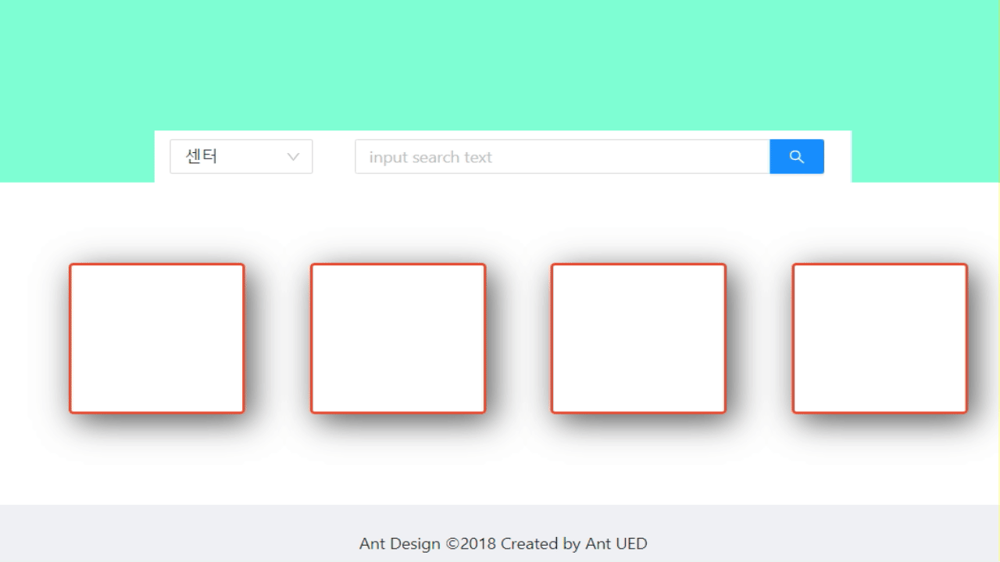

# 리액트 다시 시작하기

- 거의 1년 만에 다시 시작한다.
- 그동안 회사가 바쁘거나 이직 준비로 여건이 안 됐는데 이제야 조금 안정화가 되어서 다시 시작하려고 한다.
- 예전에 작업하던 피그마를 기반으로 좀 더 구체적으로 디자인을 잡고 다시 시작하려고 한다.
- 최종은 리액트 + DRF로 연동하여 작업할 예정이다.
- antd로 디자인 했던 것을 바꾸고 atomic으로 하려고한다. 
  - atomize를 설치하는 과정에서 자꾸 오류가 나서 원래대로 antd로 작업하려고 한다.


### 메인화면

- 만들고 나니 사진이 너무 커서 반으로 줄이고 검색창을 걸치게 만드려고 한다.


- 사진을 먼저 배치하려니 다른 div들이 깨질 것 같아 우선 사진을 제외하고 작업하기로 하였다.
  - 아래 아쿠아블루가 있는 쪽이 메인이고 그 안에 검색창을 두어서 한 눈에 보이도록 만들었다.
  - content부분이 선수들의 정보가 나오는 곳이다.


- grid로 구간을 나누어서 검색창은 마지막에 위치하도록 설정하였다.
  - select박스도 왼쪽으로 두어 팀, 선수중에 선택할 수 있도록 변경하려고 한다.


- 아래 박스에 선수들, 팀을 넣고 만들면 된다.


- 상태관리 라이브러리는 `recoil`을 사용한다.
- `npm install recoil` 명령어로 설치한다.

```react
const contents: React.FC = () => (
      <Content>
        <section className="search-box-section bs">
          <div className="search-box-child-1-div bs ps">
            <div></div>
            <div></div>
            <div  className="search-box">
              <SelectCategory/>
              <SearchInput />
            </div>
          </div>
        </section>
        <div className="site-layout-content ps">
          <Information/>
        </div>
      </Content>
  );
```

- `SelectCategory`에서 선택한 값을 `SearchInput`에도 넘겨줘야 하기에 `recoil`을 사용하여 전역변수로 관리하려고 한다.

- 아래와 같이 카테고리를 선택하면 해당 카테고리에 따라 분류가 되도록 설정하였다.
  - 팀도 넣을까 했는데 그 당시 팀과 현재 팀이 다를 수 있고, 팀으로 분리하게 되면 팀 선택 후 다시 선수를 선택해야 하는 불편함이 존재해서 선수로 구분할 수 있는 카테고리만 넣었다.



- 이제 검색을 할 때 해당 단어에 맞춰서 선수가 나오도록 하고, 카테고리 별로 검색 선수를 구분하는 작업을 진행하고, api로 데이터를 실제로 연동하려고 한다.
  - 아마 pythonanywhere을 사용해서 api를 이용할 것 같다.

### api 받아오기

- 백엔드에서 구축한 api를 받아와서 선수만큼 박스가 생성되도록 한다.

  ```javascript
  async function getPlayers() {
    try{
      const response = await axios.get("/nba/players.json");
      console.log(response);
    } catch (error){
      console.log(error);
    }
  }
  ```

- cors에러가 발생하면 패키지를 설치한 후 `src/setupProxy.js` 를 만들어서 설정한다.

  ```shell
  $ npm install http-proxy-middleware --save
  $ # or
  $ yarn add http-proxy-middleware
  ```

- setupProxy

  ```javascript
  const {createProxyMiddleware} = require("http-proxy-middleware");
  module.exports = function(app) {
      app.use(
          "/nba",
          createProxyMiddleware({
              target: "https://nbapredict.pythonanywhere.com", #api 주소
              changeOrigin: true,
          })
      )
  }
  ```


### 선수 수 만큼 box 생성하기

- api 통신하는 함수에서 정보를 파싱하여 list에 태그를 push하고 렌더한다.

  ```javascript
  async function getPlayers() {
    try{
      let _check = []
      let _cards  = []
      const response = await axios.get("/nba/players.json");
      const player_data = response["data"];
      for (let info of player_data) {
        _check.push(<input className="checkbox-guard" id={`${info["name"]}`} type="radio" name="checkbox" defaultChecked={false}/>);
        _cards.push(<div className="project guard"></div>);
        }
      setcheckbox_list(_check);
      setcards_list(_cards);
    } catch (error){
      console.log(error);
    }
  }
  ```

- 그럼 다음과 같이 박스가 생성된다.
  - 이제 선수의 부상 정보, 포지션, 사진을 다시 db에 업데이트하여 수정하기로 하자.


### 업데이트한 db의 데이터를 다시 불러와서 이미지 업데이트 하기

- pythonanywhere에서 img를 받아와서 div의 background-image에 선수들 이미지를 넣었다.
- 이제 밑에 선수들 이름을 삽입하고 포지션별로 볼 수 있도록 수정하자.

