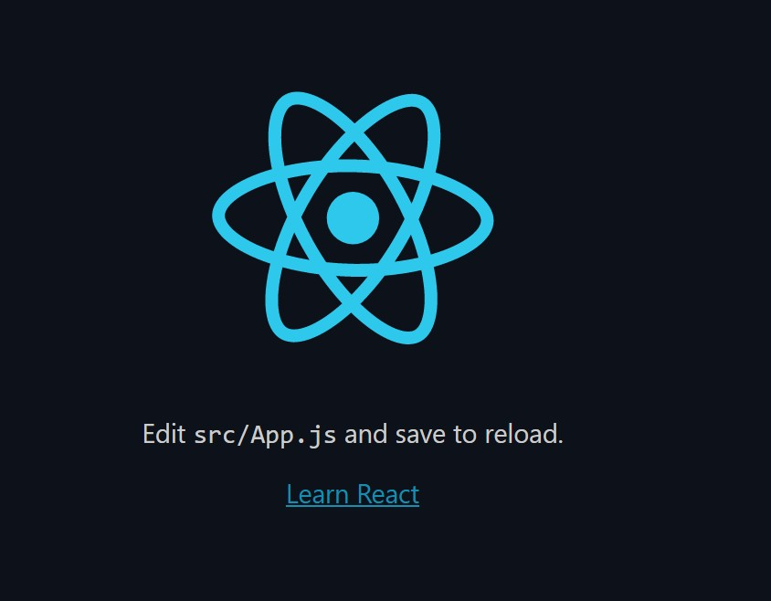
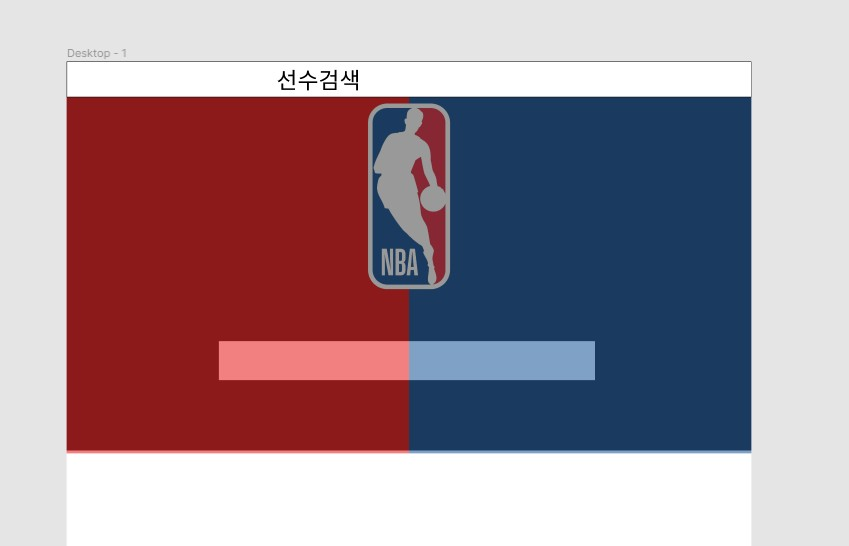
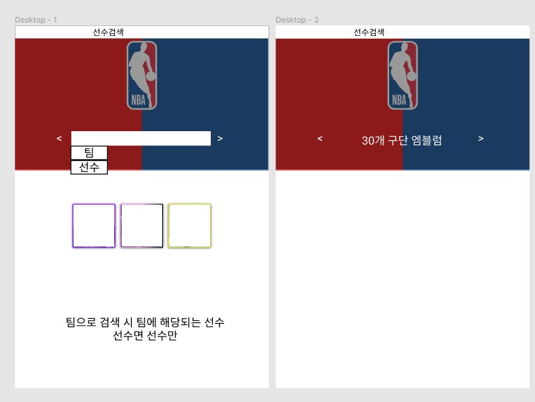

# 리액트 시작하기

```bash
C:\react-nba>yarn global add create-react-app
```

- react-nba폴더를 생성하고 yarn 명령어로 creact-react-app을 설치했다.

```bash
C:\react-nba>create-react-app nba-predict
```

- nba-predict 이름으로 app을 생성하였다.



- 성공적으로 리액트가 켜진다.

### 피그마

- 우선 피그마로 페이지 디자인 하는게 우선이라 피그마로 레이아웃을 잡기로 하였다.



- 다음과 같이 우선 첫 화면을 디자인 하였다. 
- 현재는 한 화면에 모든 정보를 담는 걸로 생각하고 있다.



- 검색 화면은 이렇게 구성하였다. 이제 선수를 클랙했을 떄 나오는  화면을 구성할 차례다.