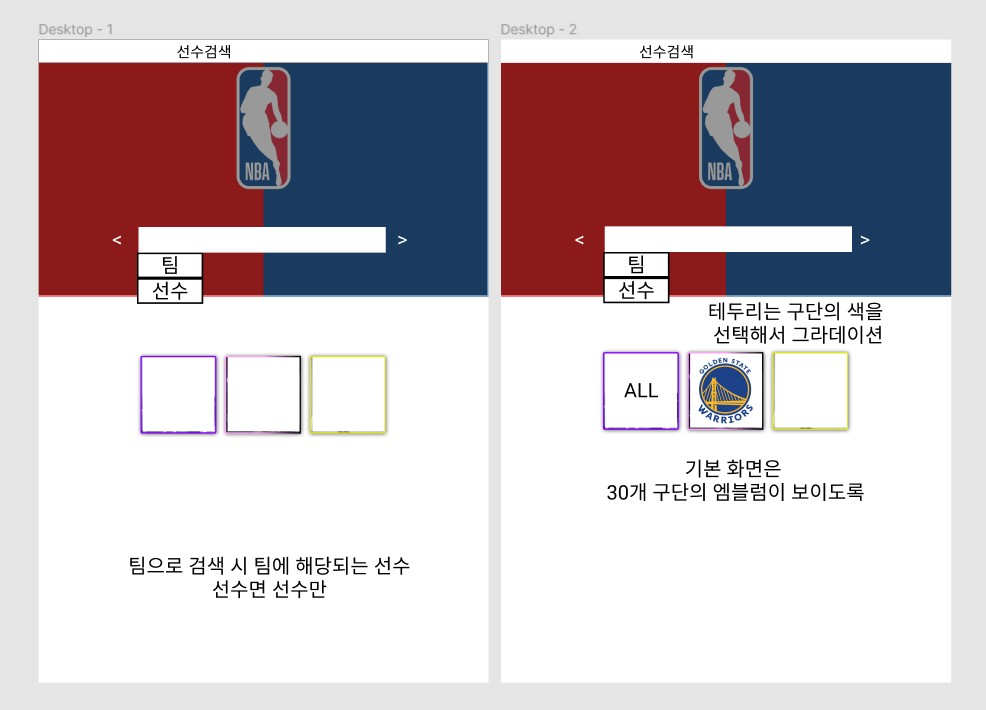
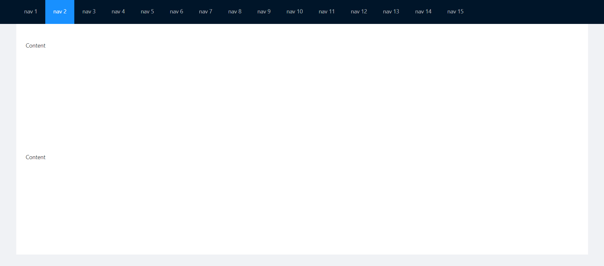

# 리액트 시작하기(with Ant Design)

```bash
C:\react-nba>yarn global add create-react-app
```

- react-nba폴더를 생성하고 yarn 명령어로 creact-react-app을 설치했다.

```bash
C:\react-nba>create-react-app nba-predict
```

- nba-predict 이름으로 app을 생성하였다.


- 성공적으로 리액트가 켜진다.

### 피그마

- 우선 피그마로 페이지 디자인 하는게 우선이라 피그마로 레이아웃을 잡기로 하였다.


- 다음과 같이 우선 첫 화면을 디자인 하였다. 
- 현재는 한 화면에 모든 정보를 담는 걸로 생각하고 있다.



- 검색 화면은 이렇게 구성하였다. 이제 선수를 클랙했을 떄 나오는  화면을 구성할 차례다.


- antd를 사용하여 전반적인 페이지를 구성하려고 한다. 우선 네비바부터 만들기로 했다.

### NavBar.js

```react
import React from 'react';
import 'antd/dist/antd.css';
import './Nav.css';
import { Layout, Menu, Breadcrumb } from 'antd';
const { Header, Content, Footer } = Layout;

class Nav extends React.Component {
    render() {
        return (
  <Layout className="layout">
    <Header>
      <div className="logo" />
      <Menu theme="dark" mode="horizontal" defaultSelectedKeys={['2']}>
        {new Array(15).fill(null).map((_, index) => {
          const key = index + 1;
          return <Menu.Item key={key}>{`nav ${key}`}</Menu.Item>;
        })}
      </Menu>
    </Header>
    <Content style={{ padding: '0 50px' }}>
      <Breadcrumb style={{ margin: '16px 0' }}>
        <Breadcrumb.Item>Home</Breadcrumb.Item>
        <Breadcrumb.Item>List</Breadcrumb.Item>
        <Breadcrumb.Item>App</Breadcrumb.Item>
      </Breadcrumb>
      <div className="site-layout-content">Content</div>
    </Content>
    <Footer style={{ textAlign: 'center' }}>Ant Design ©2018 Created by Ant UED</Footer>
  </Layout>
  // mountNode
)
}
}

export default Nav;
```

### index.js

```react
import React from 'react';
import ReactDOM from 'react-dom';
import './index.css';
import App from './App';
import Nav from './NavBar';
import reportWebVitals from './reportWebVitals';

ReactDOM.render(
  <React.StrictMode>
    <Nav />
  </React.StrictMode>,
  document.getElementById('root')
);

// If you want to start measuring performance in your app, pass a function
// to log results (for example: reportWebVitals(console.log))
// or send to an analytics endpoint. Learn more: https://bit.ly/CRA-vitals
reportWebVitals();
```


- 화면 구현에는 성공했으니 안에 내용을 내가 구성한대로 변경해보자.

### 상단바 고정하기

>  상단바를 고정시켜보자

- css에 header 속성을 추가한다.

```css
  header {
    position: fixed;
    top: 0;
    /* width: 100% */
    left: 0;
    right: 0;
  }
```

```react
<Content style={{ padding: '0 50px' , marginTop: '75px'}}>
```

- 그럼 content 부분이 겹쳐지게 되어서 marginTop를 준다
  - 여기서 일반 html이랑 달랐던 부분은 margin-top가 아니였다는 점이다.



- 이렇게 네비게이션이 고정된다.


- 사진을 전체로 박을 예정이기에 padding과 margin을 삭제했고 메뉴도 선수 검색만 남겼다.

```react
import React from 'react';
import 'antd/dist/antd.css';
import './Nav.css';
import { Layout, Menu, Breadcrumb } from 'antd';
const { Header, Content, Footer } = Layout;

export default function InnerContent() {
    return (
    <div className="site-layout-content">Content</div>
    )
}
```

```react
<Content style={{ marginTop: '66px'}}>
      <InnerContent></InnerContent>
</Content>
```

- 사진 부분은 검색 창으로 사용하기 때문에 따로 js로 빼서 생성한 다음 import하였다.